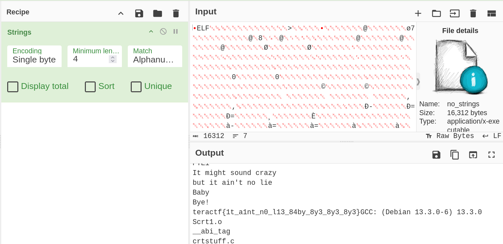

# No Strings Attached

## Beginner Pwn

### I said to her:  "I hope we're Nsync  with this challenge." "Who would makes such a bad pun?" she asked with a smirk.  *I Thought She Knew* so then I said  "*This I Promise You*,  not a *Space Cowboy*. " I continued: "*It Makes Me Ill*  but...  *It's Gonna Be Me*!" Download the attached file and find the flag.

Solution 1:

1. Download the file, run strings against it.

```sh
$ strings -n 10 no_strings
/lib64/ld-linux-x86-64.so.2
__libc_start_main
__cxa_finalize
GLIBC_2.34
GLIBC_2.2.5
_ITM_deregisterTMCloneTable
__gmon_start__
_ITM_registerTMCloneTable
It might sound crazy 
        but it ain't no lie 
teractf{1t_a1nt_n0_l13_84by_8y3_8y3_8y3}GCC: (Debian 13.3.0-6) 13.3.0
crtstuff.c
```
2. Submit the flag

**teractf{1t_a1nt_n0_l13_84by_8y3_8y3_8y3}**


Solution 2:

Open the file in CyberChef and use the Strings Recipe


