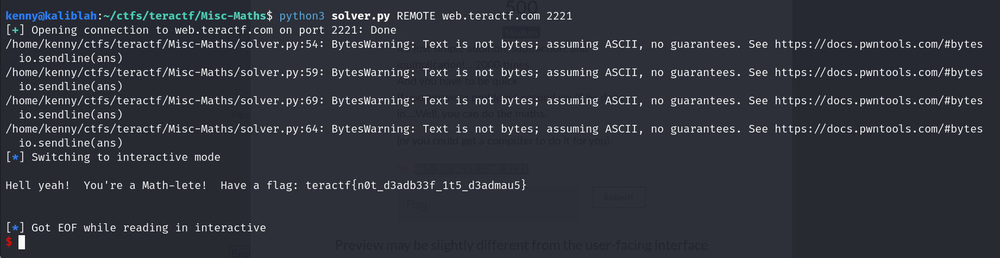

# Maths

##  Misc

### It's just simple addition, subtraction, and multiplication!....2000 times And you have to be quick If you answer a problem a second you'll be done in....Well, you can do the maths.  (or you could get a computer to do it for you)

#### After CTF Debrief:  This challenge takes a while and has time out issues when multiple people were hitting the service.  Reduce the number of iterations and increase the Jail timeout.

2000 math problems?  At a second each it would take about 33 minutes to answer them all, if you don't make a mistake.  You definitely need to automate this one.

First, connect to the site and solve some of the problems.  You can conclude there are four different operations, addition, subtraction, multiplication, and squaring.  I chose to use the pwntools library because it does the network connection wiring for you, and because I already have this a template that I use in other CTFs.

This code isn't optimized, but it gets the job done.

```python
from pwn import *

# Allows you to switch between local/GDB/remote from terminal
def start(argv=[], *a, **kw):
    if args.GDB:  # Set GDBscript below
        return gdb.debug([exe] + argv, gdbscript=gdbscript, *a, **kw)
    elif args.REMOTE:  # ('server', 'port')
        return remote(sys.argv[1], sys.argv[2], *a, **kw)
    else:  # Run locally
        return process([exe] + argv, *a, **kw)

# Binary filename
exe = './maths'
# This will automatically get context arch, bits, os etc
elf = context.binary = ELF(exe, checksec=False)
# Change logging level to help with debugging (error/warning/info/debug)
#context.log_level = 'debug'

# ===========================================================
#                    EXPLOIT GOES HERE
# ===========================================================
io = start()

# Loop through 2000 times
for i in range(2000):
# receive the question and put it into a variable
   question =  io.recvuntil(b'?')
# split the question to get the digits
   q = question.decode('utf-8').split()
# if there is a +, -, *, or squared? in the question, do the appropriate operation and send the answer
   if '+' in q:
       x, y = int(q[2]),int(q[4])
       ans = str(x + y)
   elif '-' in q:
       x, y = int(q[2]),int(q[4])
       ans = str(x - y)
   elif 'squared?' in q:
       x = int(q[2])
       ans = str(x**2)
   elif '*' in q:
       x,y = int(q[2]), int(q[4])
       ans = str(x * y)
   else:
       print(f"WTF??")
       exit()
   io.sendline(ans)

# Receive the flag
io.interactive()
```
Running it gets the flag:




**teractf{n0t_d3adb33f_1t5_d3admau5}**


