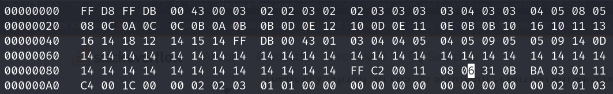
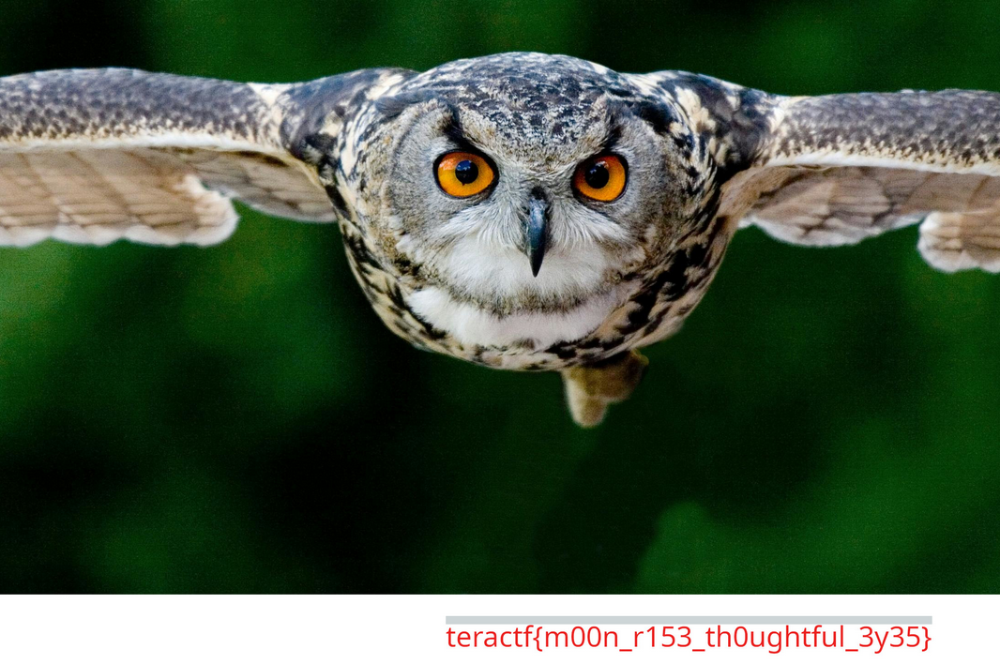

# HooHooDini

## Steg

### Why try, I know why! The feeling inside me says it’s time I was gone. Clear head, new life ahead. I want to be king now not just one more pawn

I would try to figure this out by running in through something like [https://www.aperisolve.com/](https://www.aperisolve.com/).  This file would appear normal.  I have a checklist I follow and one of the things I look for (way down the list) is a resized JPEG file.

This takes advantage of being able to manipulate the visible areas of a JPG file.  You can adjust the height of the file without distorting the width of the file.  In this case, the image appears to be complete but if you manipulate the file you can add to the height.

Use `exiftool` to figure out the size:

```sh
$ exiftool flybynight.jpg 
ExifTool Version Number         : 12.76
File Name                       : flybynight.jpg
Directory                       : .
File Size                       : 827 kB
File Modification Date/Time     : 2024:11:11 12:56:17-05:00
File Access Date/Time           : 2024:11:11 12:56:22-05:00
File Inode Change Date/Time     : 2024:11:11 12:56:17-05:00
File Permissions                : -rw-rw-r--
File Type                       : JPEG
File Type Extension             : jpg
MIME Type                       : image/jpeg
Image Width                     : 3002
Image Height                    : 1585
Encoding Process                : Progressive DCT, Huffman coding
Bits Per Sample                 : 8
Color Components                : 3
Y Cb Cr Sub Sampling            : YCbCr4:4:4 (1 1)
Image Size                      : 3002x1585
Megapixels                      : 4.8
```

Then convert the height `1585` to hex:

```sh
$ python3 -c 'print(hex(1585))'                               
0x631
```
Now search for 0631 in the file:



Replace the 6 with a 7 or 8 and save the file.  If you used a 7 you changed the height from 1585 pixels to 1841 pixels.

Open the file again and there's the flag.



**teractf{m00n_r153_th0ughtful_3y35}**
