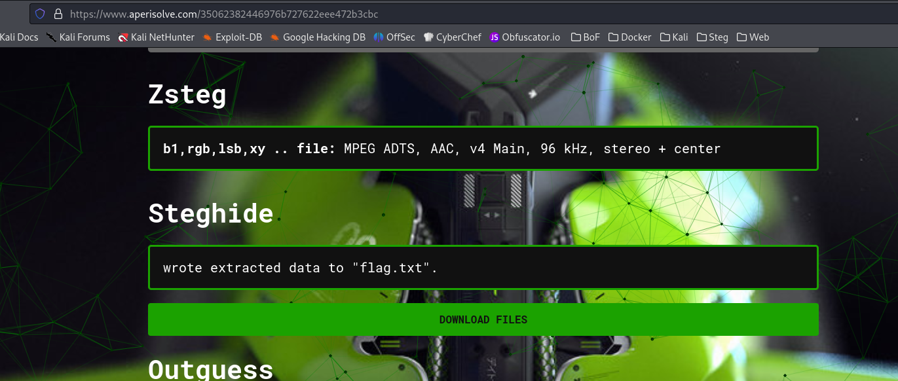

# Houdini

## Steg

###  Some guy made the flag disappear! "It's your moment, don't let is slip!  If you're good enough, you'll find a way"


The flag is embedded in the image.

Run `steghide` and when it asks for the password, hit enter.

```sh
$ strings -n 10 Harry-Houdini-1905.jpg  
((((((((((((((((((((((((((((((((((((((((((((((((((
%&'()*456789:CDEFGHIJSTUVWXYZcdefghijstuvwxyz
&'()*56789:CDEFGHIJSTUVWXYZcdefghijstuvwxyz
                                                                                                                                                 
$ steghide info Harry-Houdini-1905.jpg                            
"Harry-Houdini-1905.jpg":
  format: jpeg
  capacity: 3.0 KB
Try to get information about embedded data ? (y/n) y
Enter passphrase: 
  embedded file "flag.txt":
    size: 34.0 Byte
    encrypted: no
    compressed: yes
```

Or you can upload the file to [www.aperisolve.com](https://aperisolve.com), and notice that Steghide has extracted flag.txt.



Download the file and read the flag.


**teractf{C4tch_m3_0r_1_g0_H0ud1ni}**
