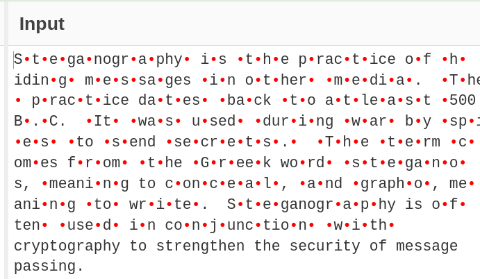
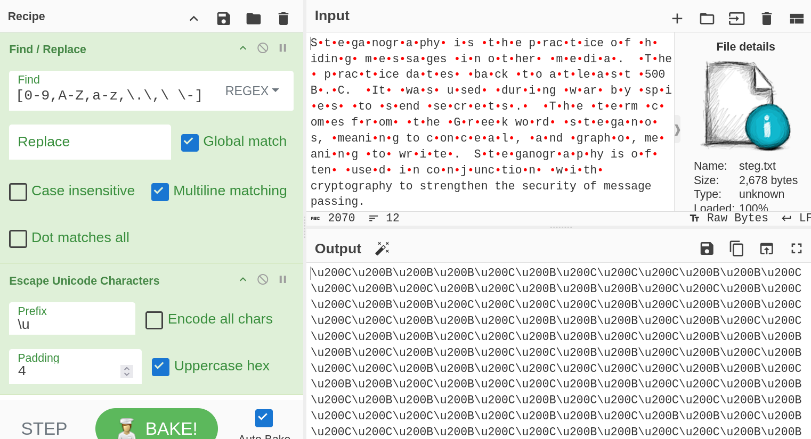
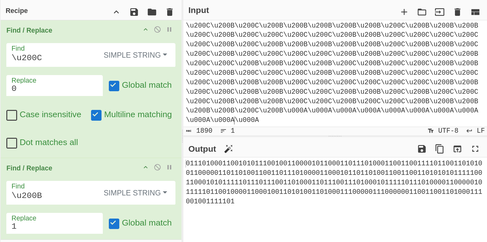
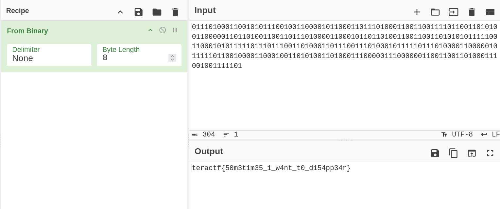

# HuhDini

## Steg

### Whatcha want whatcha need whatcha come here for?

This one is a little trickier.  Depending on what application you open the text file, you may not see the hidden text.  If you open in `Vi` or Cyberchef you can see them.  I'm going to show how I solved this in Cyberchef.

First I got rid of all the visible text, numbers, dashes, whitespaces, and punctuation using regex in the Find and Replace recipe.  You should also get rid of any newlines.

Next I used the Escape Unicode Characters recipe to see the characters.  

There isn't really a pattern but there are (should be at this point) two predominant sequences.  \u200C and \u200B are Unicode characters representing [zero width non-joiner](https://www.fileformat.info/info/unicode/char/200c/index.htm) and [zero width space](https://www.fileformat.info/info/unicode/char/200b/index.htm).  Since there are only two repeaters, think binary. 

The output shows the magic wand for CyberChef, if you hover over it you'll see the flag.  Otherwise, use the From Binary recipe and you'll get the flag.

**teractf{50m3t1m35_1_w4nt_t0_d154pp34r}**

