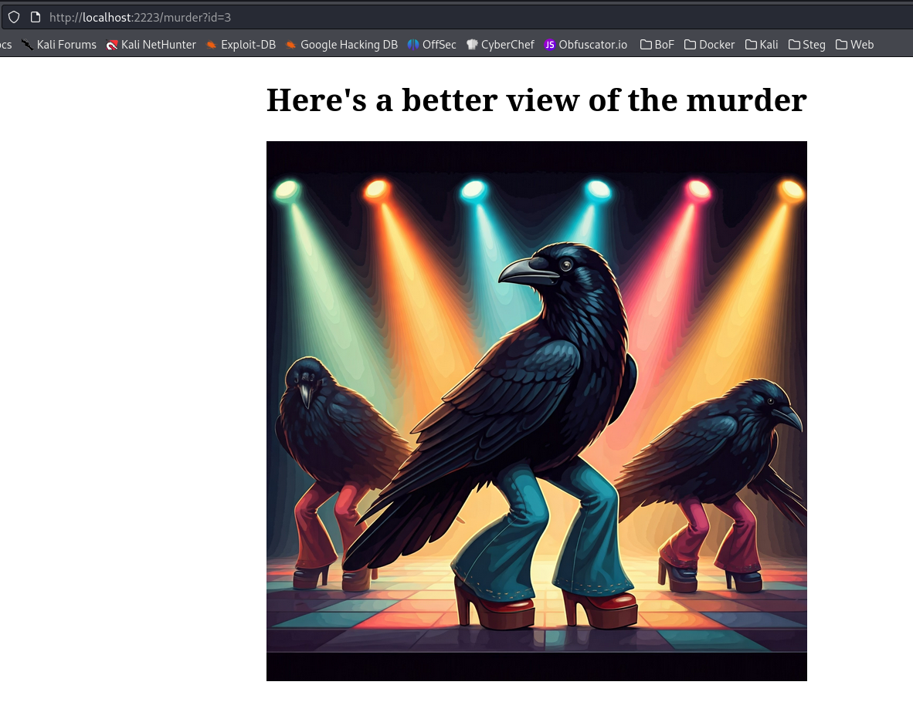

# Murder By Numbers

## Web

### 1, 2, 3, it's as easy to learn as your ABC's....Wanna see a murder?

This is an IDOR exercise.  IDOR stands for Insecure Direct Object Reference.  When this vulnerability exists, you can, for example, alter web parameters to reveal information that the current user isn't intended to see.

When you hit the landing page, you're requested to click on an image.

The page in this example (from the rightmost image) returned a larger image and the URL contains ?id=3, other images would return other values

When you change that ?id=3 to ?id=5 you get the flag.  Normally, you'd use a tool like BurpSuite (or craft a script) to iterate through different values.

**teractf{7h353_4r3_th3_cr0w5}**

