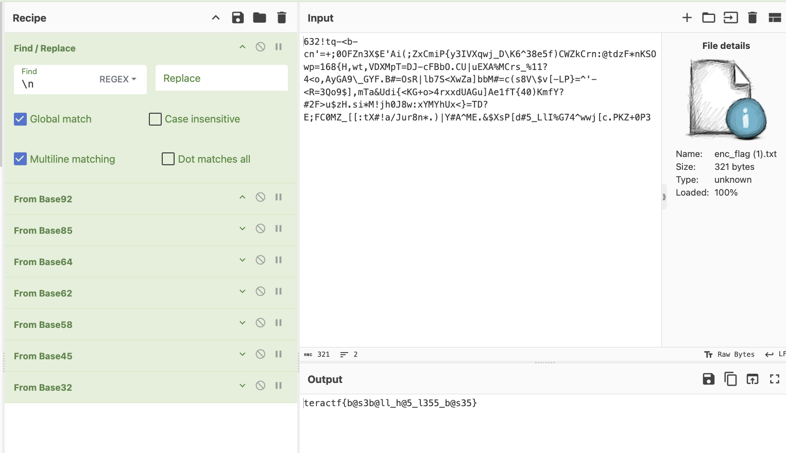

# Covering All The Bases

## Cryptography

### I have this file and was told "to get the flag I'd have to get all my bases covered", whatever that means.  See what you can make out of it.

Okay...this challenge greatly exceeded my expectations.  It was the first challenge I created for the CTF and it was the last one solved.  I was pleasantly surprised by that.  Anyway, to those that pulled their hair out on this one, I feel ya!  The solution is maddeningly simple once you know what to do.

The challenge comes with a file that contains a bunch of seemingly random text:

> 632!tq-<b-cn'=+;0OFZn3X$E'Ai(;ZxCmiP{y3IVXqwj_D\K6^38e5f)CWZkCrn:@tdzF*nKSOwp=168{H,wt,VDXMpT=DJ-cFBbO.CU|uEXA%MCrs_%11?4<o,AyGA9\_GYF.B#=OsR|lb7S<XwZa]bbM#=c(s8V\$v[-LP}=^'-<R=3Qo9$],mTa&Udi{<KG+o>4rxxdUAGu]Ae1fT{40)KmfY?#2F>u$zH.si*M!jh0J8w:xYMYhUx<}=TD?E;FC0MZ_[[:tX#!a/Jur8n*.)|Y#A^ME.&$XsP[d#5_LlI%G74^wwj[c.PKZ+0P3

The file has a newline after the text and if you load the file into CyberChef as is, you'll either need to remove the newline from the Input side or use a Find/Replace Recipe. Then, you need to cover all the bases!  Start with a Base92 recipe, then Base85, 64, 62, etc. until you get the flag.

**teractf{b@s3b@ll_h@5_l355_b@s35}**
