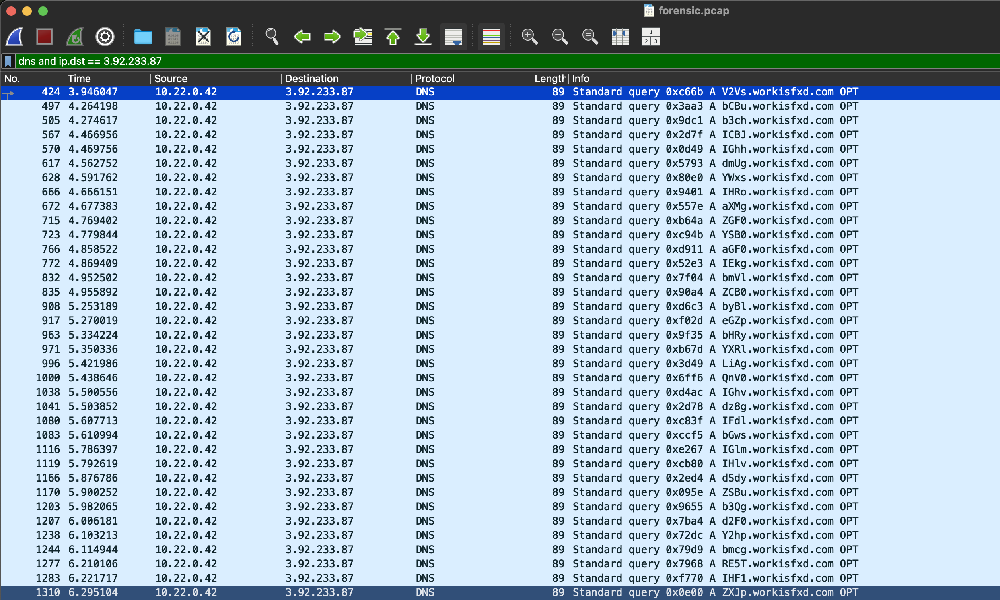

# What's In A Name?

## Forensics

### This file is supposed to have something nefarious happening.  I couldn't find it, maybe you can.

The challenge comes with a PCAP file.

The PCAP has a bunch of different protocols and sessions going on.  The one that stood out is the DNS queries.  
I filtered on `dns and ip.dst == 3.92.233.87` and saw the following:



These DNS queries to workisfxd have very suspicious subdomains.  I then broke out `tshark` to get the subdomains.  How it works:

First, `tshark` opens the pcap file and the -Y displays DNS packets that are not responses, and shows the query name.  I pipe that into `grep` because there are queries to other domains and I only want the workisfxd ones.  I pipe that output into `cut` to show the first field before the period.  Then I use xargs to echo them without a newline.  This gives me what looks like a base64 string.

```sh
% tshark -r forensic.pcap -Y "dns.flags.response eq 0" -T fields -e dns.qry.name |grep workisfxd |cut -d. -f1 |xargs -I {} echo -n {}
V2VsbCBub3chICBJIGhhdmUgYWxsIHRoaXMgZGF0YSB0aGF0IEkgbmVlZCB0byBleGZpbHRyYXRlLiAgQnV0IGhvdz8gIFdlbGwsIGlmIHlvdSdyZSBub3Qgd2F0Y2hpbmcgRE5TIHF1ZXJpZXMgdGhlIGRvb3IgaXMgd2lkZSBvcGVuLgpCVFcsIGhlcmUncyBhIGZsYWc6IHRlcmFjdGZ7d2gzbl9ETlNfZzAzc19iYWRfMXRfcjNhbGx5X2cwM3NfYmFkfQo=%
```
I then take that output, remove the '%' at the end, and echo it into `base64 -d` to decode it.

```sh
% echo "V2VsbCBub3chICBJIGhhdmUgYWxsIHRoaXMgZGF0YSB0aGF0IEkgbmVlZCB0byBleGZpbHRyYXRlLiAgQnV0IGhvdz8gIFdlbGwsIGlmIHlvdSdyZSBub3Qgd2F0Y2hpbmcgRE5TIHF1ZXJpZXMgdGhlIGRvb3IgaXMgd2lkZSBvcGVuLgpCVFcsIGhlcmUncyBhIGZsYWc6IHRlcmFjdGZ7d2gzbl9ETlNfZzAzc19iYWRfMXRfcjNhbGx5X2cwM3NfYmFkfQo=" |base64 -d
Well now!  I have all this data that I need to exfiltrate.  But how?  Well, if you're not watching DNS queries the door is wide open.
BTW, here's a flag: teractf{wh3n_DNS_g03s_bad_1t_r3ally_g03s_bad}
```

**teractf{wh3n_DNS_g03s_bad_1t_r3ally_g03s_bad}**
