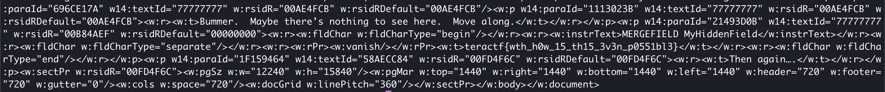

# Zebra Information Propaganda

## Forensics

### A friend of mine who is a zebra hater sent me this zebra propaganda.  Honestly, I don't see the problem.  Maybe there's some hidden meaning.

This challenge includes a Word file in .docx format.  I think around 2019 the format for .docx and .xlsx etc. change to be zip archives.

```sh
% unzip zebra_info_propaganda.docx
Archive:  zebra_info_propaganda.docx
  inflating: [Content_Types].xml
  inflating: _rels/.rels
  inflating: word/document.xml
  inflating: word/_rels/document.xml.rels
  inflating: word/theme/theme1.xml
  inflating: word/settings.xml
  inflating: customXml/item1.xml
  inflating: customXml/itemProps1.xml
  inflating: word/styles.xml
  inflating: word/webSettings.xml
  inflating: word/fontTable.xml
  inflating: docProps/core.xml
  inflating: docProps/app.xml
  inflating: customXml/_rels/item1.xml.rels
```

Then it's a matter of finding the right file.  Since the flag is going to start with "teractf" I ran a recursive `grep` on the directory and found the flag in word/document.xml.  Here's a snippet:



**teractf{wth_h0w_15_th15_3v3n_p0551bl3}**
