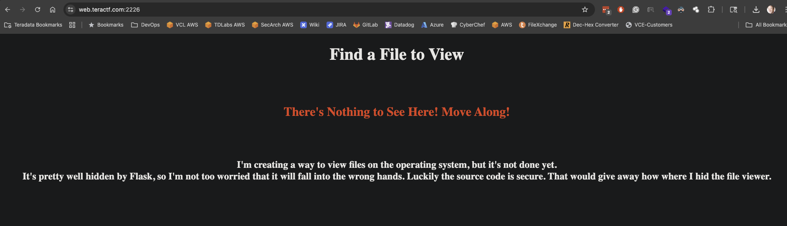
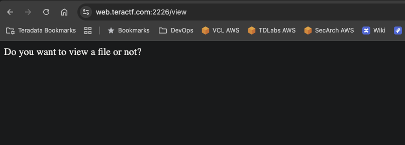
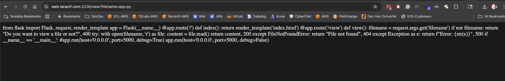
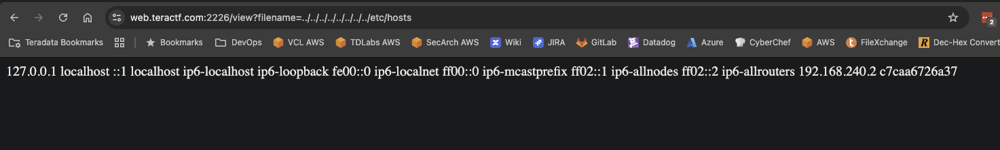
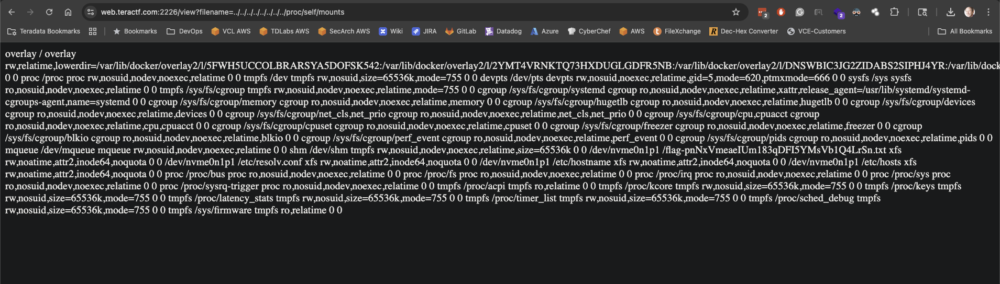
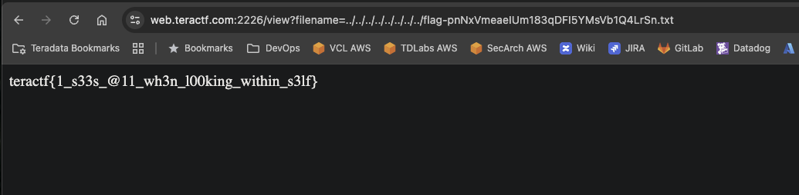

# Mount Up

## Misc

### I started to create a website to view files on the OS, but it's not finished.  This wasn't the exact Dockerfile I used but you'll get the gist.  I actually mounted the flag to the / directory.

If you view the Dockerfile attached to the challenge, you'll see the flag is getting mounted to the root (/) directory with a random extension.

Then, reading the app.py file, you can see there's a view directory that expects a filename as a parameter:

```python
@app.route('/view')
def view():
    filename = request.args.get('filename')
    if not filename:
        return "Do you want to view a file or not?", 400
    try:
        with open(filename, 'r') as file:
            content = file.read()
        return content, 200
    except FileNotFoundError:
        return "File not found", 404
    except Exception as e:
        return f"Error: {str(e)}", 500
```
I went to the landing page of the site and got this:



Not much to see there, switching to the view:



Okay, let's try it with the filename parameter, looking for the app.py file in the local directory:



Now, let's see if a path traversal will work:



Sweet!  But now what?  We need a file listing the files/volumes mounted for this container.  Luckily, there's a /proc/self/mounts file that shows them:



There's the flag name, time to get the flag:



**teractf{1_s33s_@11_wh3n_l00king_within_s3lf}**
