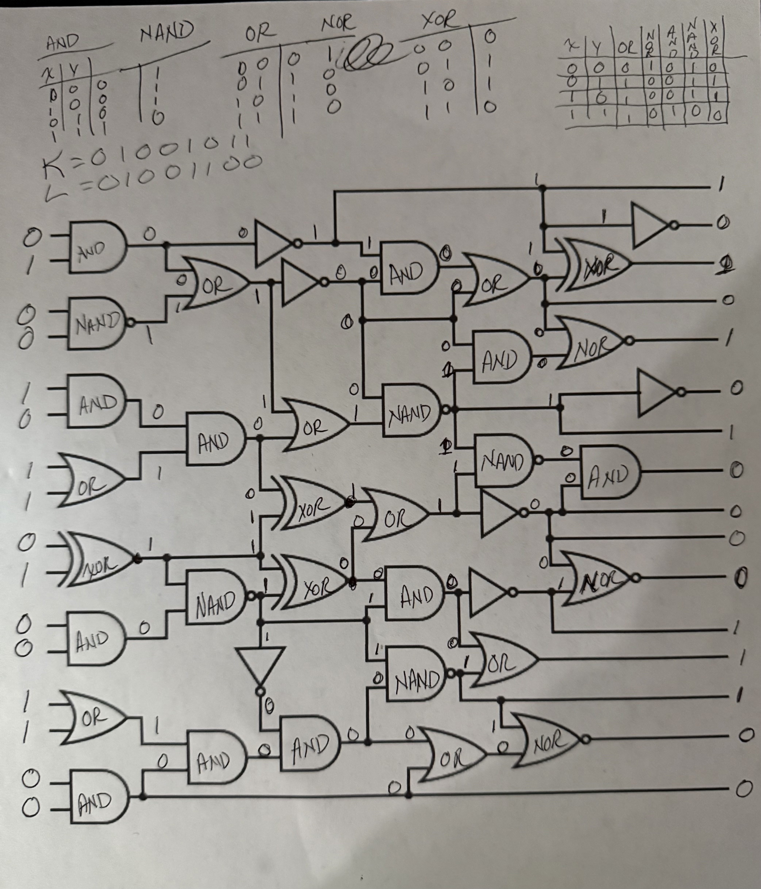

# Out Of The Gate

## Misc

### I had a nightmare the other night.  A mysterious voice said that, if I put in the uppercase initials of the CTF challenge creator, I'd get the flag.  NOTE: you'll need to wrap the output in teractf{} NOTE: The answer inside teractf{} will be binary.  e.g., teractf{1010101000000000}  You get 10 guesses.  No bruteforcing here.

Computers CPUs have billions of logic gates.  It's how it adds, it's how it checks if two numbers are the same, etc.  Now you get to play the CPU and solve this for yourself!!  

Ok, the initials of the challenge creator is KL (duh).  In Binary thats 01001011 and 01001100.  Plug those into the starting gates from top to bottom.  Then solve it!  Here's my printout.

**teractf{1010101000011100}**
