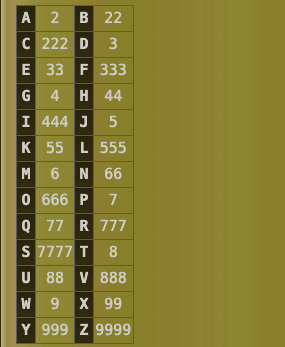
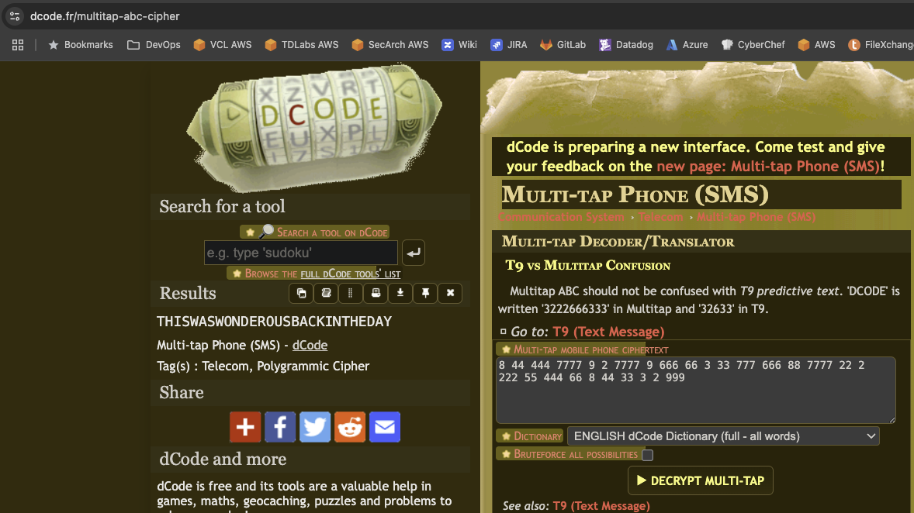

# So Many Sevens

## Misc

### I found these numbers written in an old notebook, I bet I wrote down a flag in 2001.  I removed some spaces that looked unnecessary, but kept the curly braces.

> 83377722228333{844444777792777796666633377766688777722222255444668443332999}

Okay, if you've ever used the old Nokia phones to text, you know what this is.  It's called Multi-Tap.  The number of times you press the keys is the letter you get.

The problem I (intentionally) created was removing the spaces.  For example, there are 5 fours in a row.  Is that two G's and an I?  Is it two H's and a G?  Figure out the spacing, and you get the flag.

**teractf{thiswaswonderousbackintheday}**
**teractf{this_was_wonderous_back_in_the_day}**

