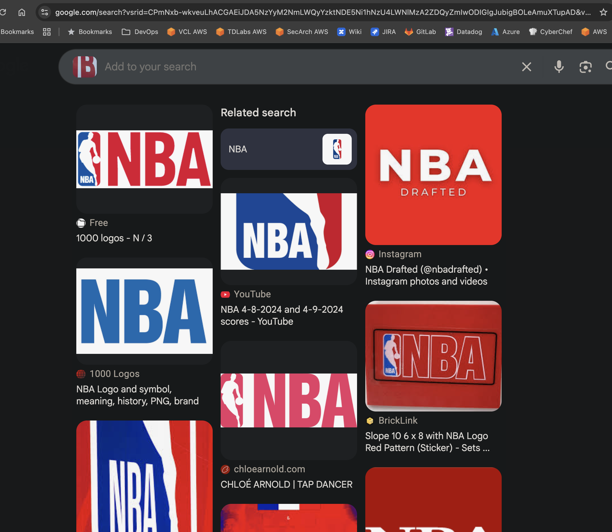
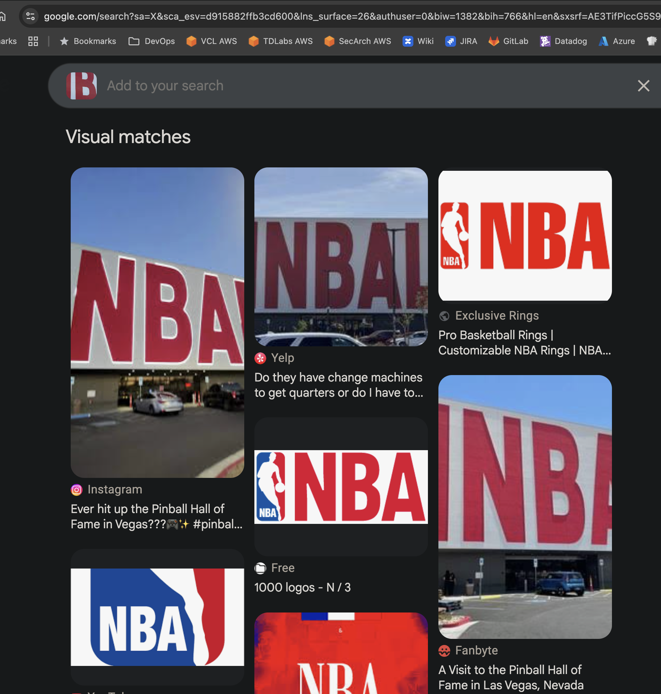
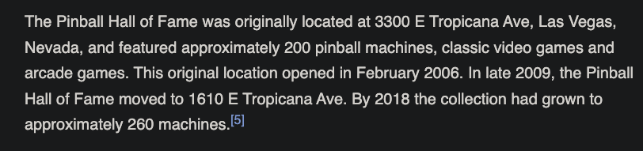

# A Little Bit of History

## OSINT

### Once you figure out what this is, it should be easy to figure out where it was originally located. The flag is original street address, using underscores for spaces, truncate the street suffix using standard abbreviations, and no punctuation.  E.g., 1600 Pennsylvania Avenue would be teractf{1600_Pennsylvania_Ave_NW}.

I wish I had a $5 for everyone who glossed over the "original street address" in the clue :joy:

This challenge comes with the following image:

If you do an image search on it in Google Images you'll get a TON of National Basketball Association (NBA) sites.  

But that's not what this is looking for.  If you futz around with the image (resizing the search area) you'll eventually get references to the Pinball Hall of Fame in Las Vegas.

If you look it up in Wikipedia, you'll see the reference to the original location:

**teractf{3300_E_Tropicana_Ave}**
