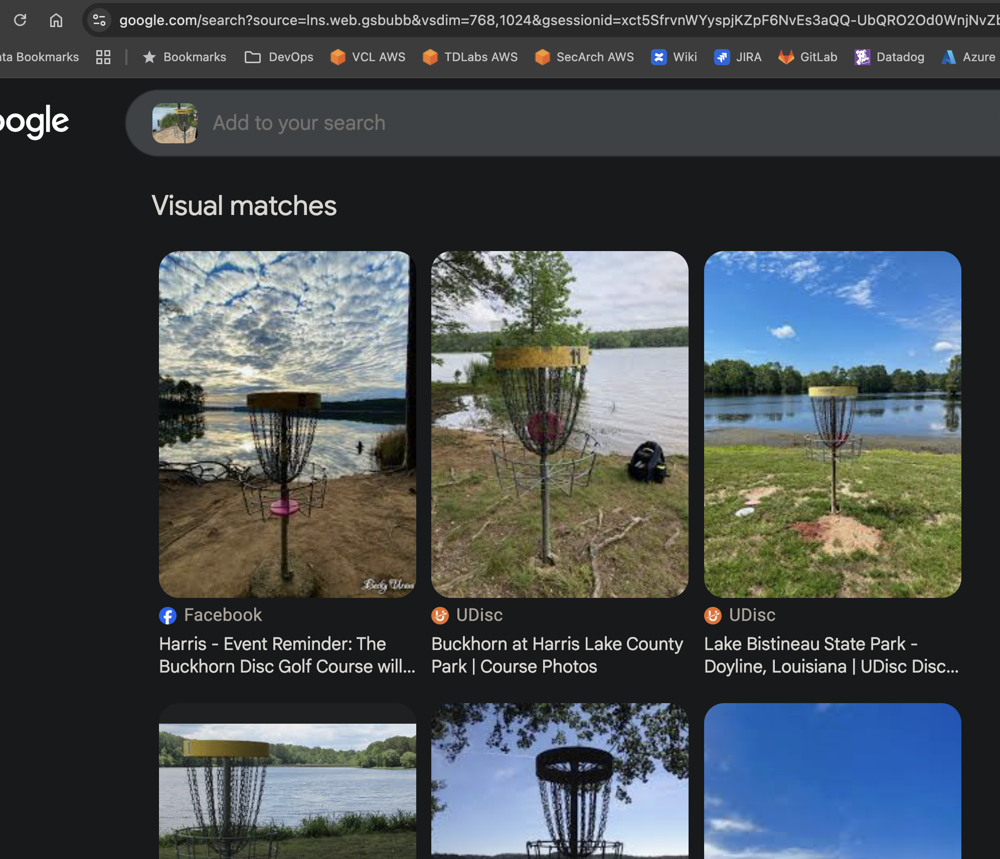
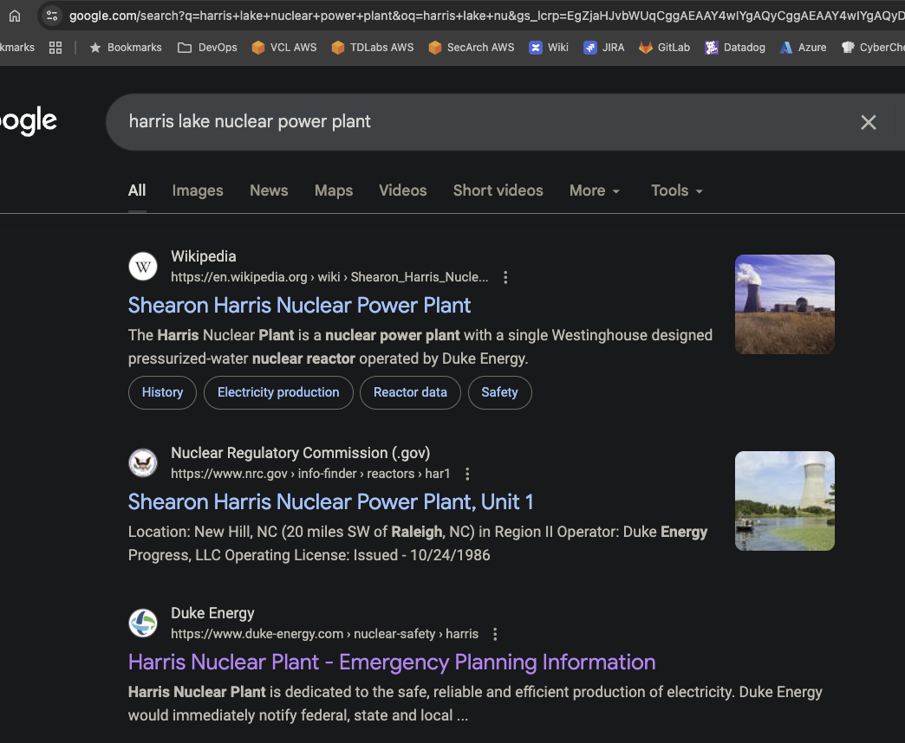
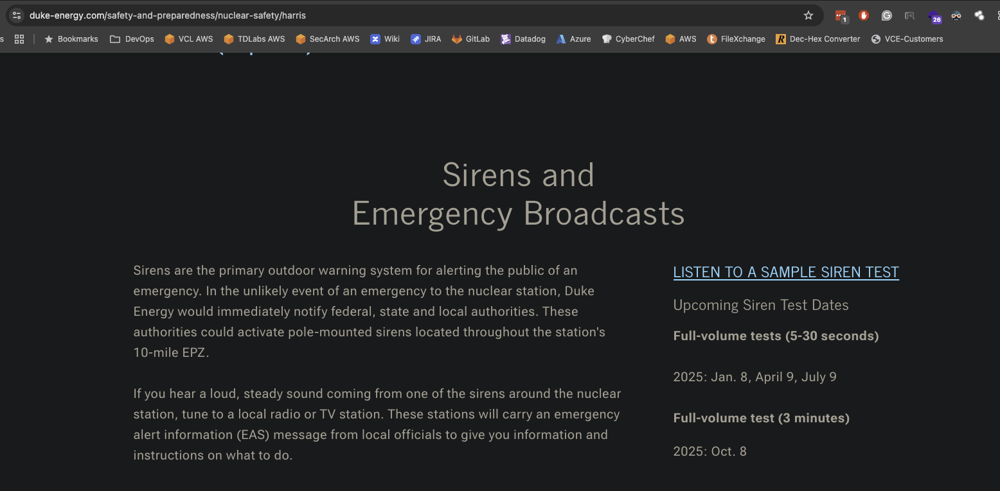

# And The Horn Sounds

## OSINT

### Nevermind that good looking guy in the picture getting his first tournament ace, I know he's distracting but do your best.  The flag is the date the siren last sounded and for how long (in seconds).  e.g., teractf{YYYY-MM-DD-Seconds}, where seconds could be one to three digits.

This challenge came with an image:

Now if you do a reverse image search in Google Images and cut that good looking guy out of the picture 

the first to references are for Harris Lake / Buckhorn Disc Golf Course.

Looking back at the picture and still ignoring that good looking guy, that Nuclear Power Plant cooling tower in the background could be important.  They have warning systems, and sirens (horn).

If you Google "Harris Lake Nuclear Power Plant" the third reference is about Emergency Planning Information.

The third entry down looks promising.

If you scroll down a little and look on the right side of the page it says there was a test on October 8, 2025 and it was three minutes long.

**teractf{2025-10-08-180}**
