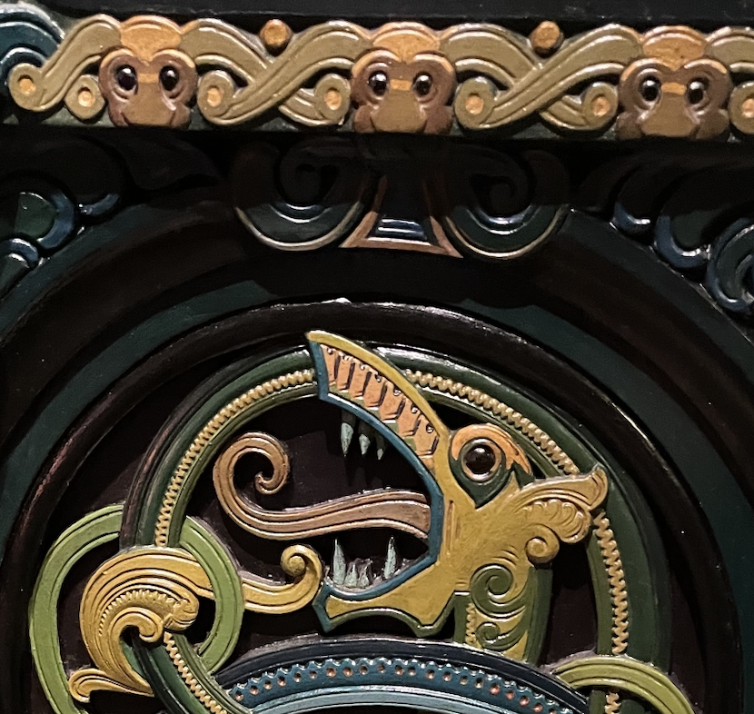

# Dragons Be Here

## OSINT

### What's the inventory number of this piece?  Wrap it in teractf{} and use underscores for spaces

This challenge came with the following image:

When I first tried this, it was more difficult.  Now I'm wondering if Google is caching my results....hmmm...

Anyway, if you do an image search, you'll get something like this:

These results gave me the exact page I needed as the first entry.  Drilling down into it:

From there, I just scrolled down the page until I got the inventory number, aka the flag.  NOTE: If you looked at the English version of the page, the Inventory Number wasn't translated. Crazy:

**teractf{RF_MO_OAO_2018_10}**
