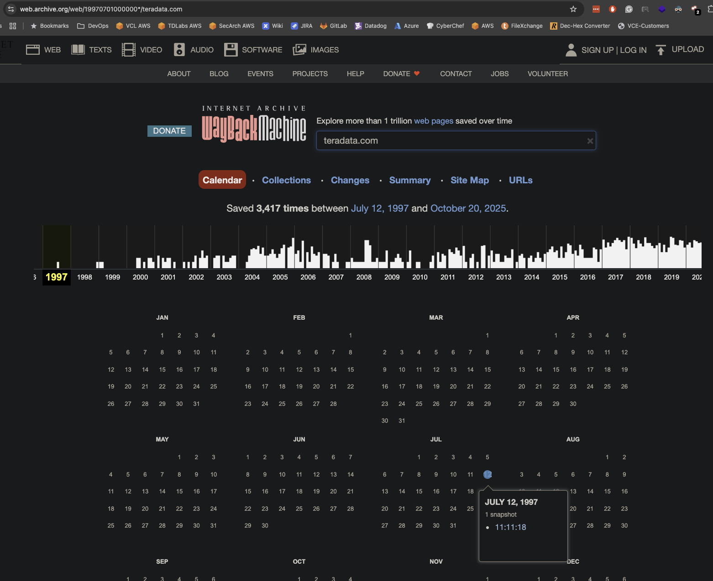
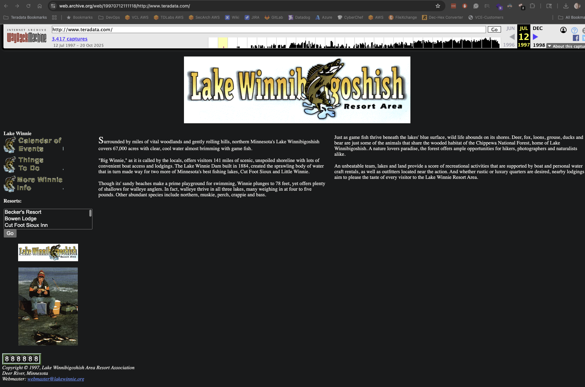

# Squatters

## OSINT

### Teradata's web presence didn't alway provide information about our products.  The flag is the copyright owner using underscores for spaces.  E.g. Sum Dum Guy would be Sum_Dum_Guy

This requires the [WayBack Machine](https://web.archive.org).

If you search teradata.com and go to the very first entry from 12 July 1997

You get a page with a squatter!

If you look in the lower left corner of the page, you'll see the copyright owner is Lake Winnibigoshish Area Resort Association

**teractf{Lake_Winnibigoshish_Area_Resort_Association}**

