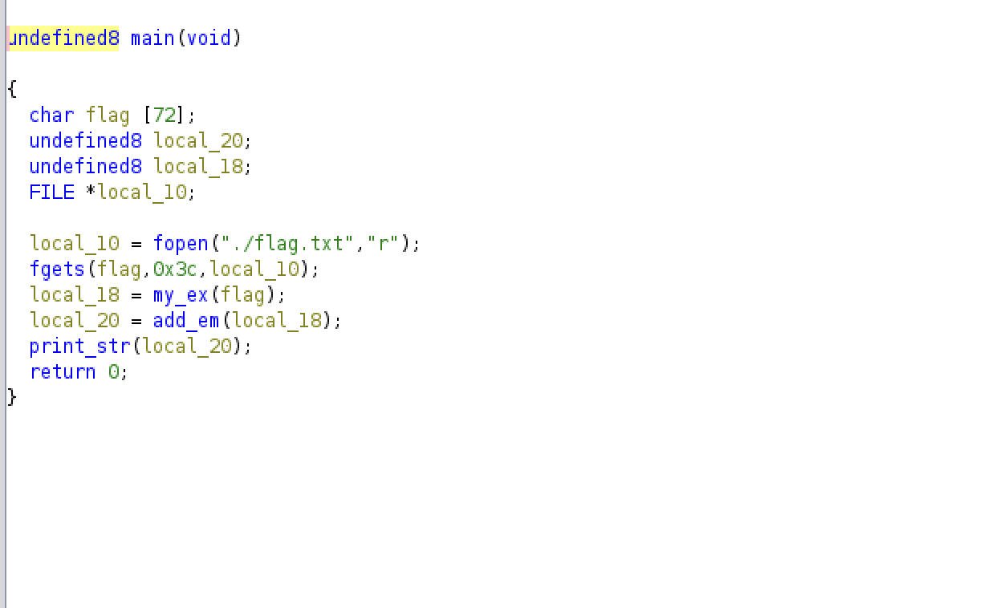
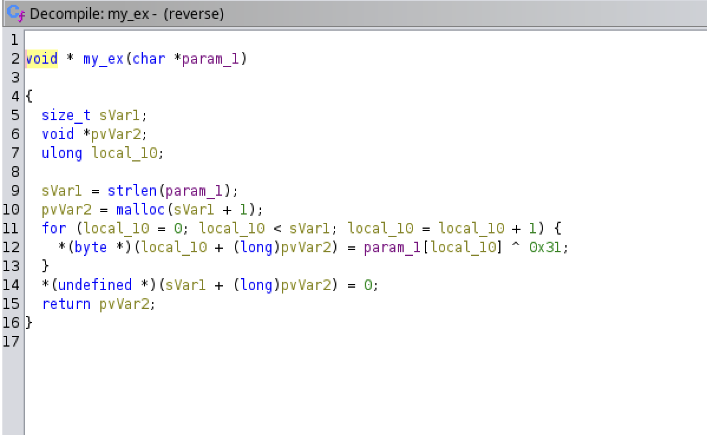
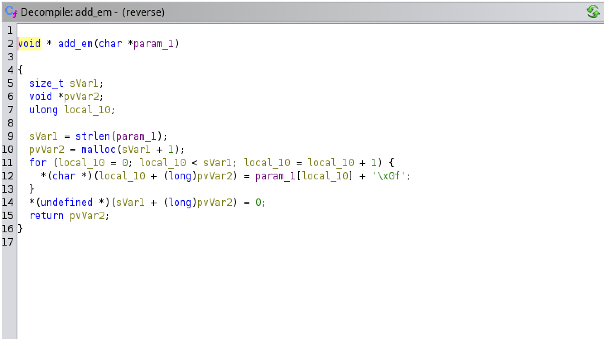

# Reverse Dis

## Reverse Engineering

### What's a reverse dis?  I guess it's a compliment?  
### Here's the flag: 5463525F61546659877D685F54117D5568116E7D54681152117D5F52117D6B536C5487506C117D66536E615487106E7D615F6C6C135B4A
### Maybe this file can give you some help:

This comes with the binary `reverse_dis`

I decompiled the file using Ghidra.  Looking at the `main` function:



It looks like it reads the flag into a variable then calls two other functions before printing the encoded flag.

The first one is my_ex(), which XORs each byte with the value 0x31:



And then it adds 15 (0xf) to each byte:



I wrote the following script to reverse the process and print the flag

```python
#!/usr/bin/env python3

enc_flag = "5463525F61546659877D685F54117D5568116E7D54681152117D5F52117D6B536C5487506C117D66536E615487106E7D615F6C6C135B4A"
flag = ""


for i in range(0, len(enc_flag), 2):    # start at 0 and go by 2's
  my_num = int(enc_flag[i:i+2], 16)     # Get two characters and convert them to hex values
  flag += chr((my_num - 0xf) ^ 0x31)    # Next, subract 15 from that number and then xor it with 0x31, converting the result to a character.

print(flag)
```

**teractf{I_hat3_wh3n_th3r3_ar3_multIpl3_functI0n_call5}**
