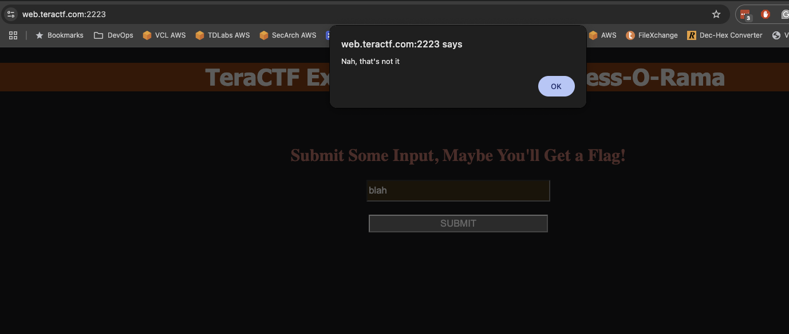
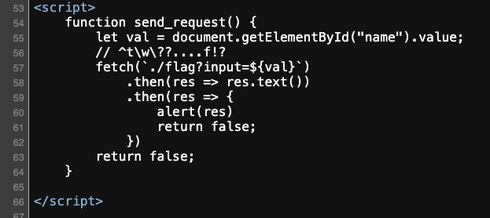
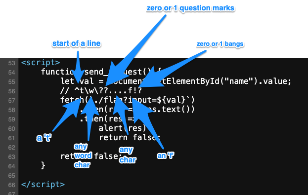
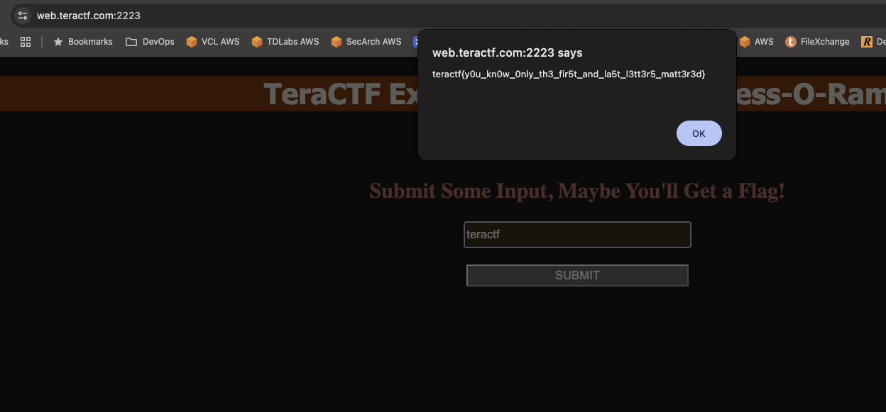
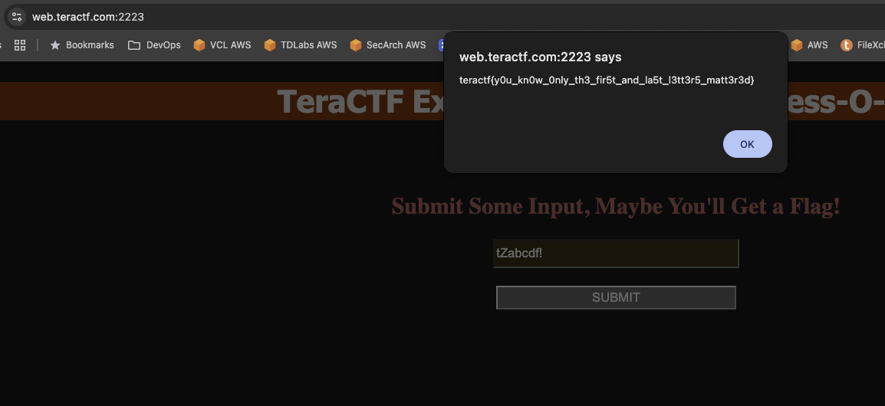

# Guess-O-Rama

## Web

### Guess the input, win a flag!  What more could you ask for.  I'm not even going to charge you for trying.  NOTE: Bruteforcing or attempting to bruteforce this challenge will lead to your banishment from the CTF, don't bruteforce it, there's a more elegant solution.

The landing page is asking for any input without much guidance.

I put in any value to see what it would do:

I went to look at the source code and found this to be interesting:

That section starting with "//" is a comment...and it looks like a regular expression.  Dissecting it this is what I figured out:

So it's looking for something that starts with a 't', followed by any word character, zero or one question marks, four of any character, an 'f', and zero or 1 bangs (exclamation marks).  In other words it needed at a minimum seven characters starting with a 't' and ending with an 'f' (or eight characters ending in 'f!').  Hey look!  `teractf` works perfectly.

You could also put gibberish in between the 't' and 'f'

**teractf{y0u_kn0w_0nly_th3_fir5t_and_la5t_l3tt3r5_matt3r3d}**
