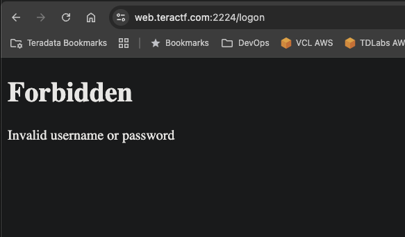

# Take Your Best Shot

## Web

### Take your best shot at finding the flag!  The admin password was randomly assigned, good luck.  You can try guest:password if you'd like

Simple enough: the landing page is a login page that asks for the user's username and password.  The clues hint that we'll need admin.  First, trying the admin with a random password got the following:

Okay, let's try one that should be good.  I used the guest user with the password as password and got the following:

This is looking like an SQLi challenge.  The "Shot" in the title is another name for an injection; the guy who created this challenge thinks he's so clever! :joy:

Next, I wanted to see what would happen if I put a single quote after the username and put a comment after that (admin';-- -), and it didn't work.

The next thing I tried was the correct injection.  I used a single quote in the password field, then used an OR 1=1 to make the return value true.

**teractf{1s_a_sql_1nj3ct10n_a_sh0t}**

