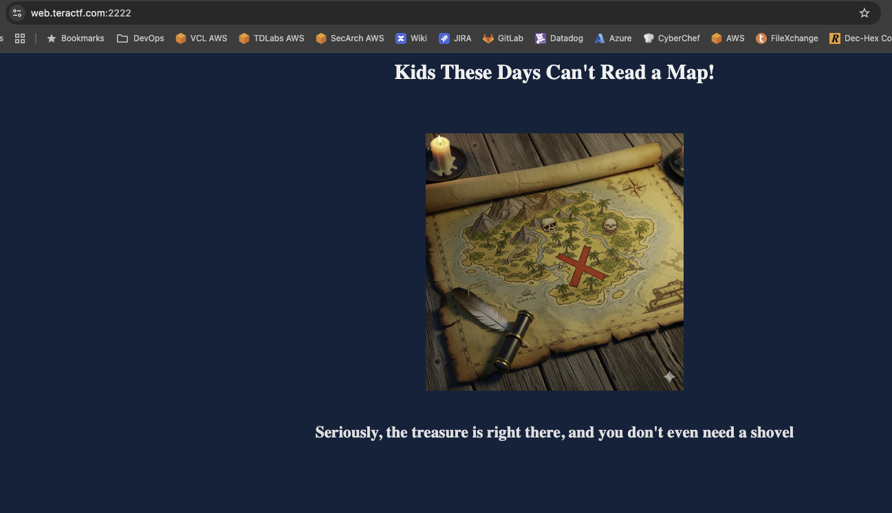
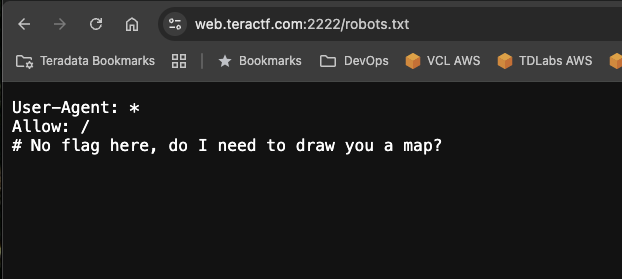
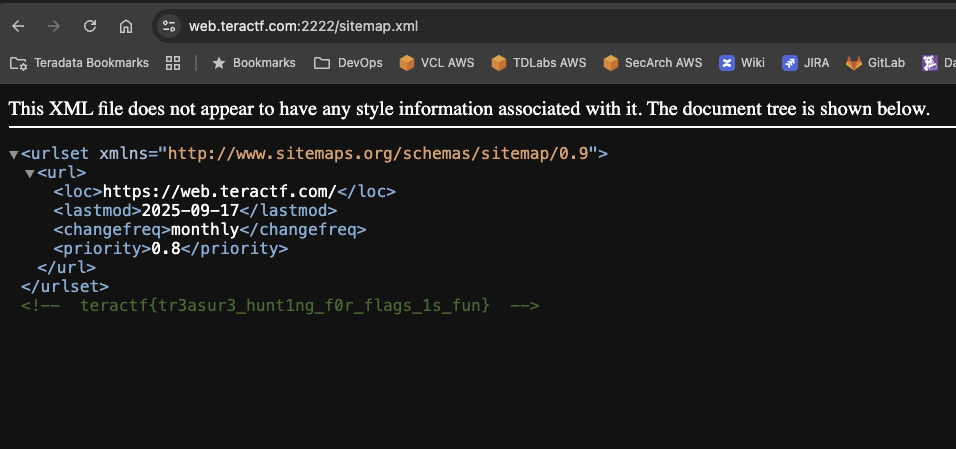

# X Marks the Spot

## Web

### A mini treasure hunt!

The landing page and the clue in the challenge allude to treasure and maps.

The first place I usually look for this type of challenge is robots.txt

And because of all the clues, the next thing I looked at is sitemap.xml

**teractf{tr3asur3_hunt1ng_f0r_flags_1s_fun}**
