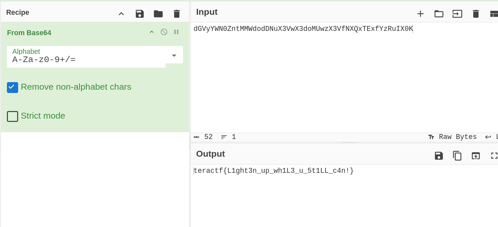

# Take It Easy

## Crypto

### It won't get any easier than this, so take it easy.

```sh
$ echo "dGVyYWN0ZntMMWdodDNuX3VwX3doMUwzX3VfNXQxTExfYzRuIX0K" |base64 -d
teractf{L1ght3n_up_wh1L3_u_5t1LL_c4n!}

```

or

```sh
$ cat take_a_look_at_me.txt|base64 -d
teractf{L1ght3n_up_wh1L3_u_5t1LL_c4n!}

```

or use CyberChef



**teractf{L1ght3n_up_wh1L3_u_5t1LL_c4n!}**


