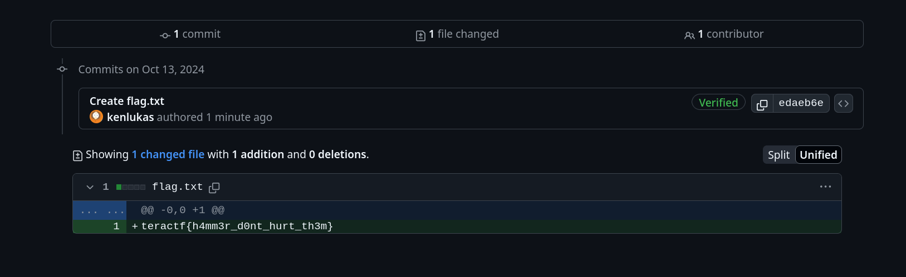

# 2 Legit 2 Quit

##  Forensics

### I created a flag in another users repo by mistake.  I deleted the fork but they told me it's still there!  Can you "Hammer" on this for a bit?  Oh, the repo is https://github.com/lukasew/nothing2see.  This is too le-Git too quit.

There is a John Hammond [video about this](https://youtu.be/DYdMXwDfRdA)

I wrote this script to search for the beginning of the commit id:

```python
import itertools
import requests

chars = 'abcdef0123456789'

def all_possible(chars, length):
    yield from itertools.product( *([chars] * length))

for p in all_possible(chars, 3):
    short_hash = 'e' + ''.join(p)
    url = f"https://github.com/lukasew/nothing2see/commit/{short_hash}"
    r = requests.get(url)

    print(f"trying {short_hash}...")

    if r.status_code != 404:
        print(f'Short hash {short_hash} gave status {r.status_code} for URL {r.url}')
        break
```

Running it eventually finds the commit:

```sh
trying edab...
trying edac...
trying edad...
trying edae...
Short hash edae gave status 200 for URL https://github.com/lukasew/nothing2see/commit/edae
```
Commit id edaeb6e36f31b7f5b5b8f5de3ec8fa52771ff819



**teractf{h4mm3r_d0nt_hurt_th3m}**

