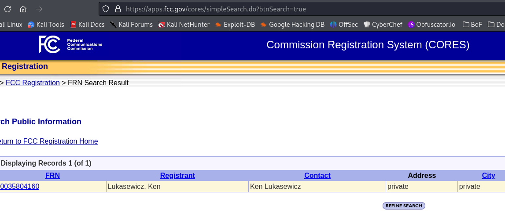

# Spirit of Radio

##  Forensics

###  This file was found in a USB stick that was wrapped in paper.  Scribbled on the paper:  "For the words of the profits were written on the studio walls."  
Flag Format: teractf{FRN_OperatorClass_GrantDate}  where date is mmddyyyy

It's pretty obvious from listening to the .wav file that this is morse code.

I used [Morse Code World](https://morsecode.world/) to decode it.  The output is:

> KQ4UPR

If you Google that, there are a few references.  The first one gives the Operator Class and the Grant date.

I Googled `kq4upr frn lookup` and found a license search.  If you put in the call sign you'll get the FRN.

**teractf{0035804160_Technician_08152024}**
