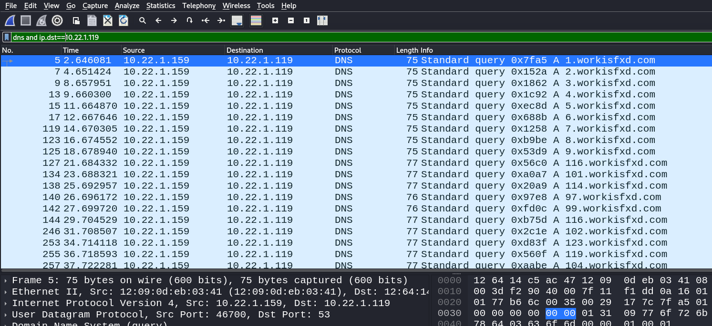
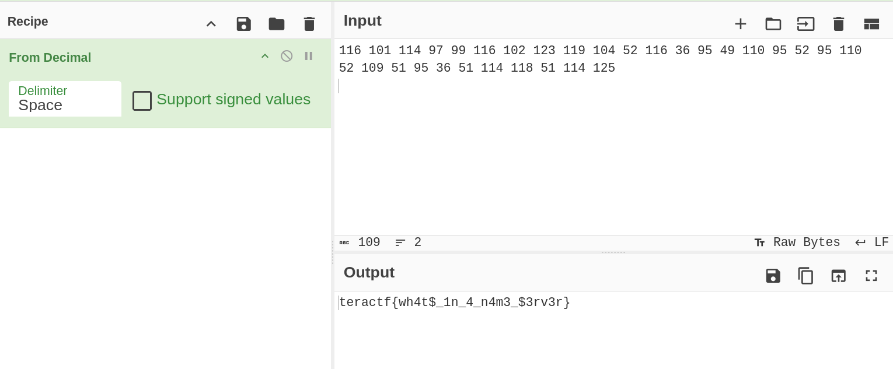

# A Boy Named Goo

## Forensics

### Even though the moment passed me by... I was still able to grab a packet capture I believe has evidence of impropriety.  I told them: It may be the "letters that you never meant to send" but you need to be careful!  But I won't tell 'em your name.  Download and analyze the file, I think there's a flag in there.

Open up the pcap file in WireShark.  You can see the DNS queries are looking for a strange subdomain.



I switched to tshark to get the output easier.

```sh
$ tshark -r boynamedgoo.pcap -Y 'dns.qry.name contains workisfxd.com and ip.src==10.22.1.159' -T fields -e dns.qry.name                               
1.workisfxd.com
2.workisfxd.com
3.workisfxd.com
4.workisfxd.com
5.workisfxd.com
6.workisfxd.com
7.workisfxd.com
8.workisfxd.com
9.workisfxd.com
116.workisfxd.com
101.workisfxd.com
......
```

The first 9 subdomains are a red herring.  Everything else is the decimal representation of the ASCII Table.

Run the following to pull the subdomains out.

```sh
$ tshark -r boynamedgoo.pcap -Y 'dns.qry.name contains workisfxd.com and ip.src==10.22.1.159' -T fields -e dns.qry.name |cut -d '.' -f 1 | tr '\n' ' '
1 2 3 4 5 6 7 8 9 116 101 114 97 99 116 102 123 119 104 52 116 36 95 49 110 95 52 95 110 52 109 51 95 36 51 114 118 51 114 125                                                                                                                                                  
```

You'll be left with the following if you ignore the number 1-9

```sh
116 101 114 97 99 116 102 123 119 104 52 116 36 95 49 110 95 52 95 110 52 109 51 95 36 51 114 118 51 114 125
```

Paste that in Cyberchef, use the From Decimal recipe and you're done.




**teractf{wh4t$_1n_4_n4m3_$3rv3r}**
