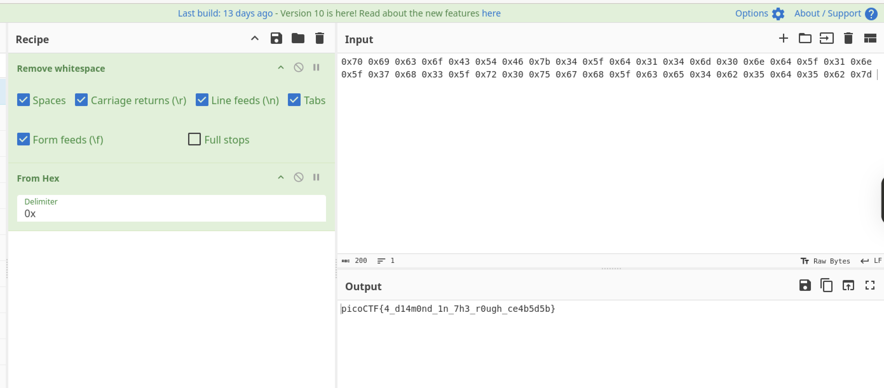

# Picker I

## Reverse Engineering

### This service can provide you with a random number, but can it do anything else?

I removed a couple of "esoteric" functions because they are noise for this challenge.

```python
import sys


def getRandomNumber():
  print(4)  # Chosen by fair die roll.
            # Guaranteed to be random.
            # (See XKCD)

def exit():
  sys.exit(0)
  
def win():
  # This line will not work locally unless you create your own 'flag.txt' in
  #   the same directory as this script
  flag = open('flag.txt', 'r').read()
  #flag = flag[:-1]
  flag = flag.strip()
  str_flag = ''
  for c in flag:
    str_flag += str(hex(ord(c))) + ' '
  print(str_flag)
  
  
while(True):
  try:
    print('Try entering "getRandomNumber" without the double quotes...')
    user_input = input('==> ')
    eval(user_input + '()')
  except Exception as e:
    print(e)
    break
```

When this is run, it prompts you to try the getRandomNumber function, and then does an eval with the user input with `()` appended to the end.

If you follow the prompt, and put in getRandomNumber it returns the [xkcd](https://xkcd.com/221/) version of random!  

But there's a win function in the script.  Since there's no sanitization of user input we can put anything.

```sh
$ nc saturn.picoctf.net 55265
Try entering "getRandomNumber" without the double quotes...
==> getRandomNumber
4
Try entering "getRandomNumber" without the double quotes...
==> win
0x70 0x69 0x63 0x6f 0x43 0x54 0x46 0x7b 0x34 0x5f 0x64 0x31 0x34 0x6d 0x30 0x6e 0x64 0x5f 0x31 0x6e 0x5f 0x37 0x68 0x33 0x5f 0x72 0x30 0x75 0x67 0x68 0x5f 0x63 0x65 0x34 0x62 0x35 0x64 0x35 0x62 0x7d 
```
Alright!  Cyberchef here I come!




**picoCTF{4_d14m0nd_1n_7h3_r0ugh_ce4b5d5b}**
