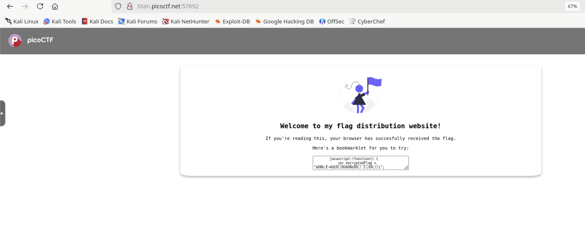
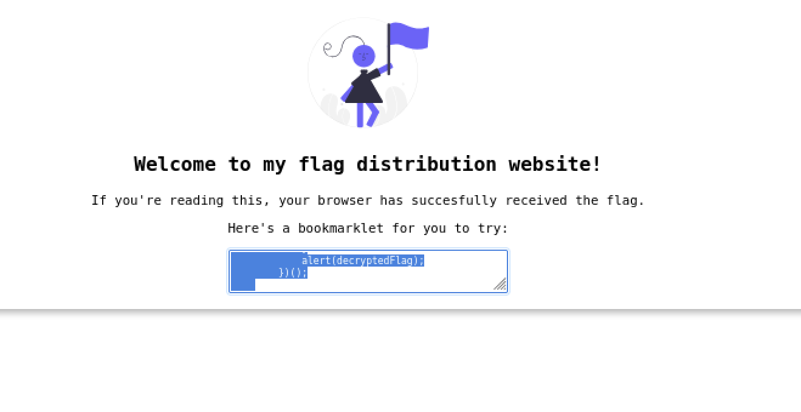
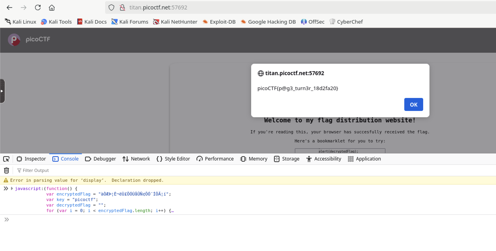

# Bookmarklet

## Web Exploitation

### Why search for the flag when I can make a bookmarklet to print it for me?

There are three hints:

> A bookmarklet is a bookmark that runs JavaScript instead of loading a webpage.
> What happens when you click a bookmarklet?
> Web browsers have other ways to run JavaScript, too.

The landing page has a bookmarklet, which is obviously JavaScript.



Clicking in the box copies its contents to the clipboard.



```javascript
javascript:(function() {
            var encryptedFlag = "àÒÆަȬë٣֖ÓÚåÛÑ¢Õӗ¨Í•ÕĦ–í";
            var key = "picoctf";
            var decryptedFlag = "";
            for (var i = 0; i < encryptedFlag.length; i++) {
                decryptedFlag += String.fromCharCode((encryptedFlag.charCodeAt(i) - key.charCodeAt(i % key.length) + 256) % 256);
            }
            alert(decryptedFlag);
        })();
```

The encryptedFlag and key are right there.  The decryption loop subtracts a character in the key from a character in the encryptedFlag.  Then it adds 256 to the result and promptly removes it by taking the modulo 256 of the result (basically subtracting it).

I plugged it into the browser console, and it gave an alert with the flag.



**picoCTF{p@g3_turn3r_18d2fa20}**
