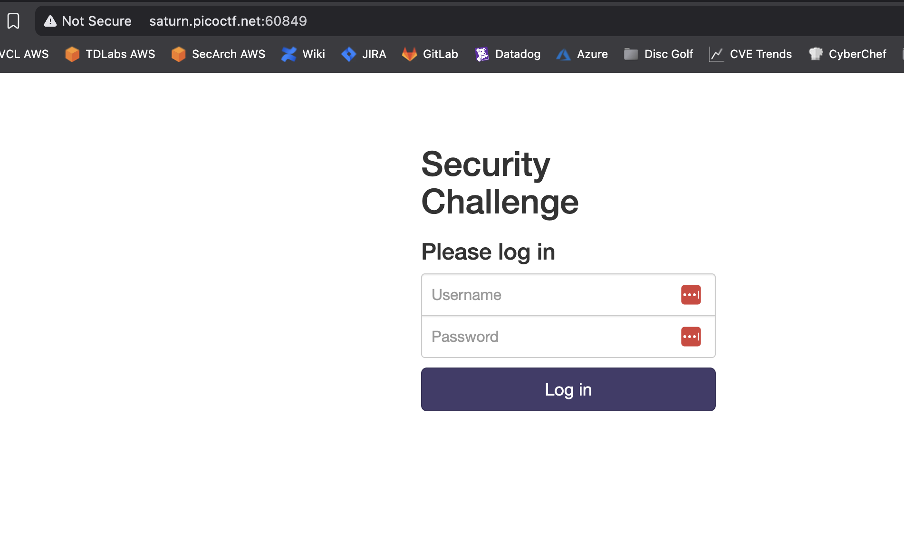
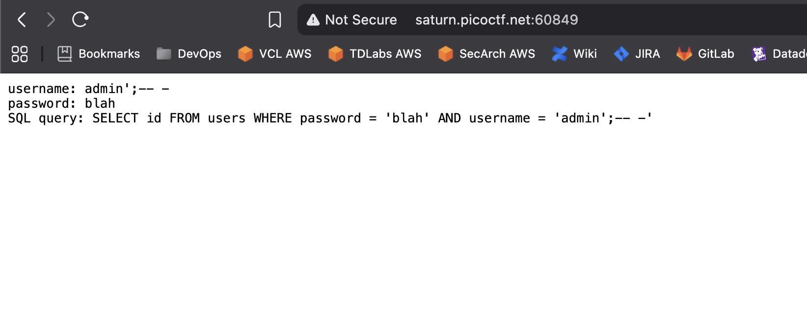
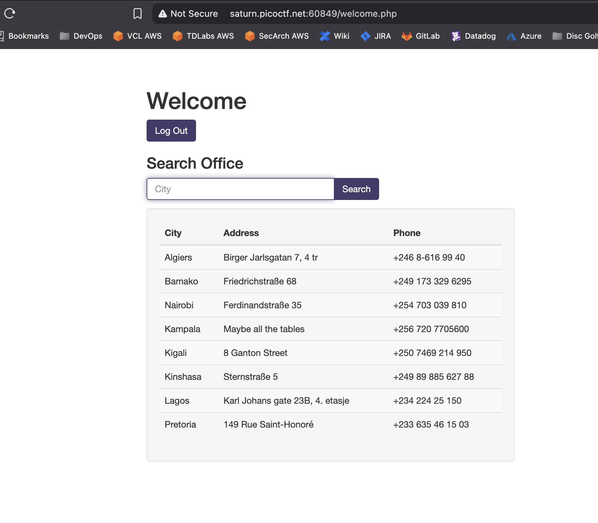
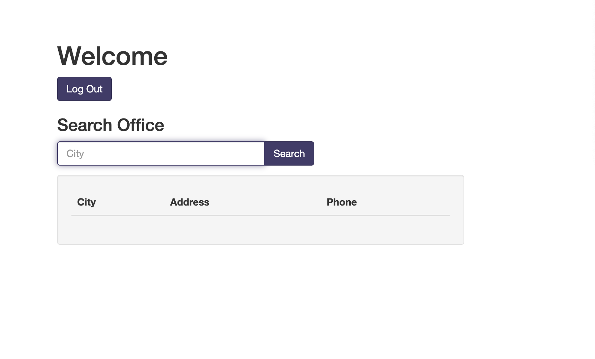
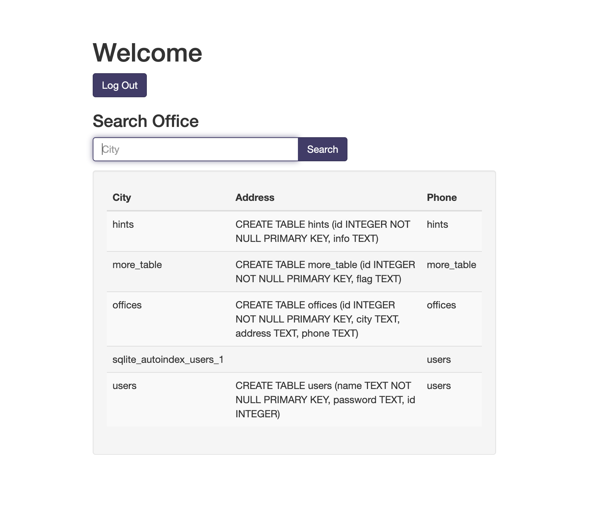
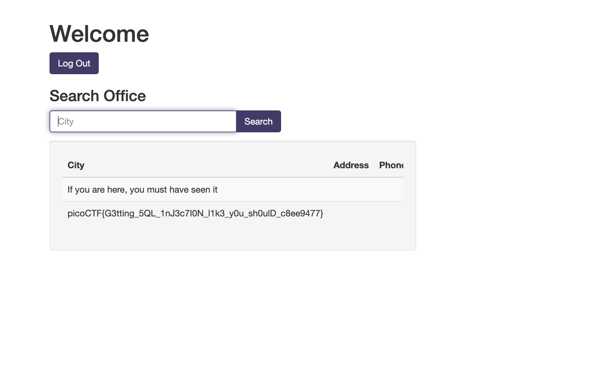

# More SQLi

## Web Exploitation

### Can you find the flag on this website.

The hint for this challenge is, simply, `SQLiLite`

The landing page is pretty straightforward:

I tried the normal SQL injection of `admin' or 1=1;-- -` and any password and saw the SQL statement is searching for the password first.

The good news is that a SQL injection exists.  The slightly bad news is that even though this makes things slightly easier, it's a little less controlled.  If the password field is the only one `select`ed it will match all ids.  I'm not sure how this will effect things.  To leverage this SQL injection I'll use any username and `' or 1=1;-- -` in the password field. 

Wow!  It worked.  As we're presented with another input field, I want to see if this is open to a SQL injection so I just add a `'` and hit Search.

:joy:

Since I have no clue what databases or tables there are, I'm going to need to do some poking around.  I'm assuming since the clue points to SQLiLite and that challenge used sqlite3, that this challenge does too.  Sqlite has a schema table called [sqlite_master](https://sqlite.org/schematab.html) that stores the schema (tables, indexes, triggers, and views) for the database.  The name and sql fields are what I need to know to look for the right table.  The name is obvious.  The `sql` field is used to store the statement used to create the table. I'm going to use a UNION to allow me to combine two queries.  The first will be the default query of the website.  The second will be the query of the sqlite_master table.  And we know the webpage will show three fields, I'll select three from master, but the third is going to be null to prevent an error.

`' UNION SELECT name, sql, null from sqlite_master;-- -`

Excellent!  From the results we can see that `more_table` has a column called `flag`.  I'll use another UNION to show the details

`' UNION SELECT flag, null, null from more_table;-- -`

:joy: :joy:

**picoCTF{G3tting_5QL_1nJ3c7I0N_l1k3_y0u_sh0ulD_c8ee9477}**
