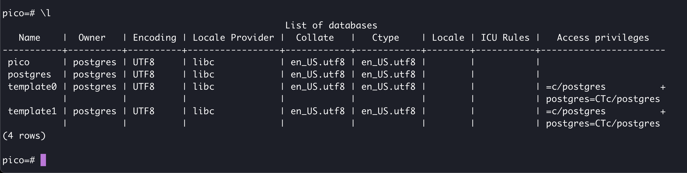
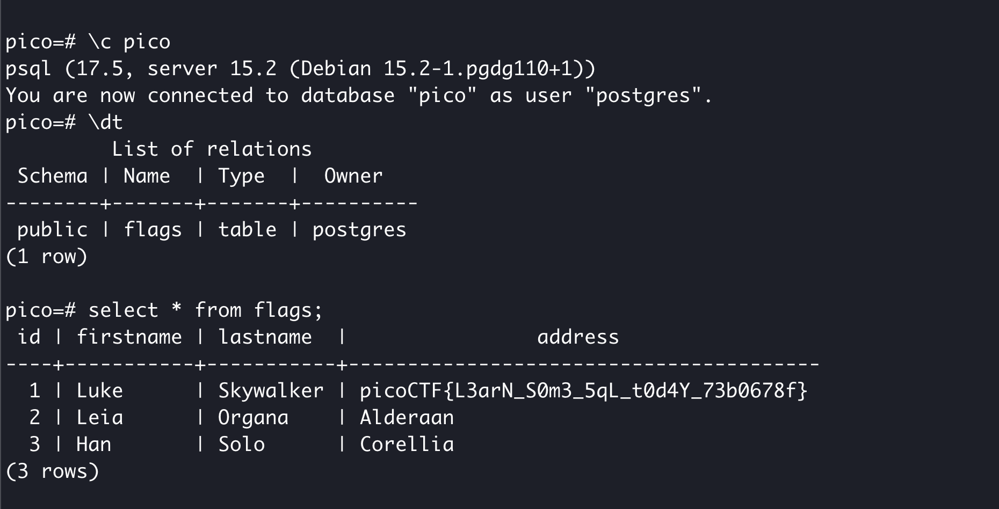

# SQL Direct

## Web Exploitation

### Connect to this PostgreSQL server and find the flag!

This looks simple enough...although Postgresql has a quirky syntax IMO.

First, log in to the database using the instructions from the challenge.

Then let's list (\l) the databases:

`pico` is the only "non-standard" database; the next step is to connect (\c) to the pico database.  From there, we'll describe the tables (\dt).  From the image below, there is only one table called 'flags'.  I'll print the whole table using a `select * from flags;` command

**picoCTF{L3arN_S0m3_5qL_t0d4Y_73b0678f}**
