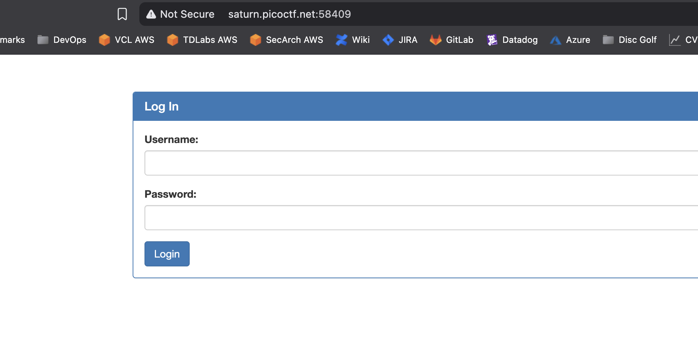

# SQLiLite

## Web Exploitation

### Can you login to this website?

Go to the link in a browser (after it gets stood up).

Okay, I'll use 'blah' as the username and 'moreblah' as the password just to see what happens.

Alright!  It returns the SQL command it runs with the username and password.  Because this challenge is clearly about a SQL Injection (SQLi), lets try a basic injection.  For a SQL state, if we add our own single-quote then an OR followed by a statement we know is true, and end it with a comment to ignore the rest of the SQL statement the website adds, I hope to get a positive result.  In other words I'm going to use the following as the username:

> blah' OR 1=1;-- -

I'm also entering anything in the `password` field in case it complains if it's blank.

:joy: :joy:

Awesome!  Now to find the flag.  First stop is to look at the source.

Yes!  There it is.

**picoCTF{L00k5_l1k3_y0u_solv3d_it_d3c660ac}**

