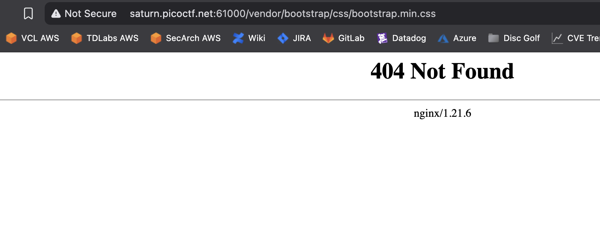
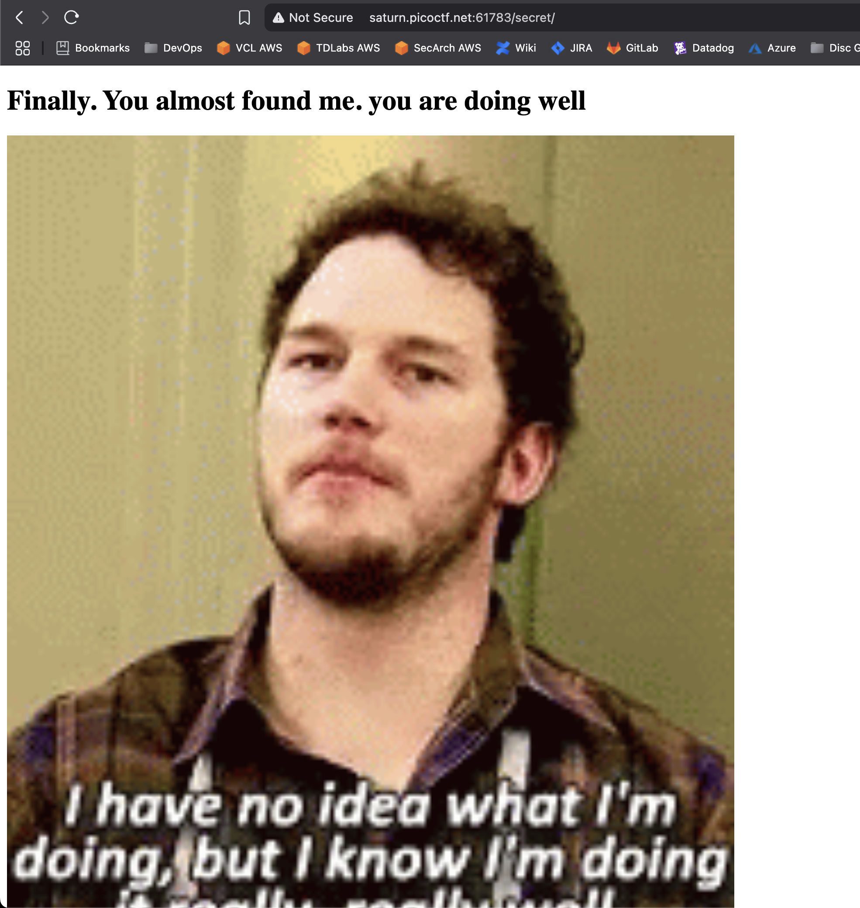
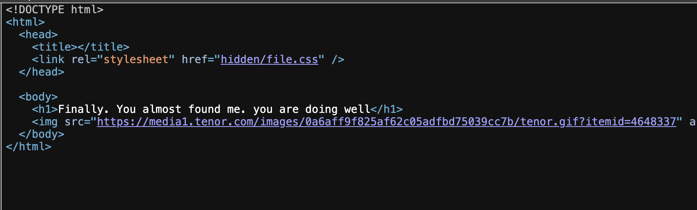
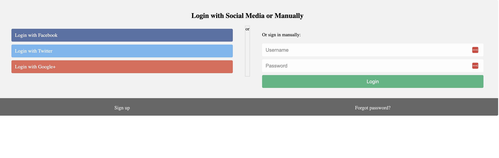
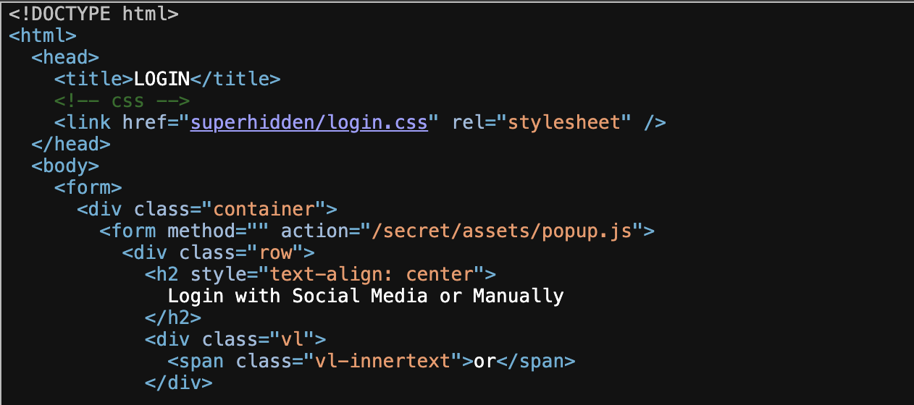
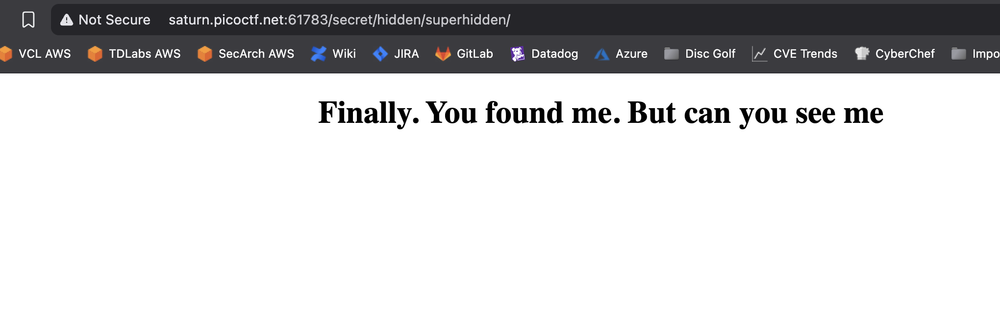
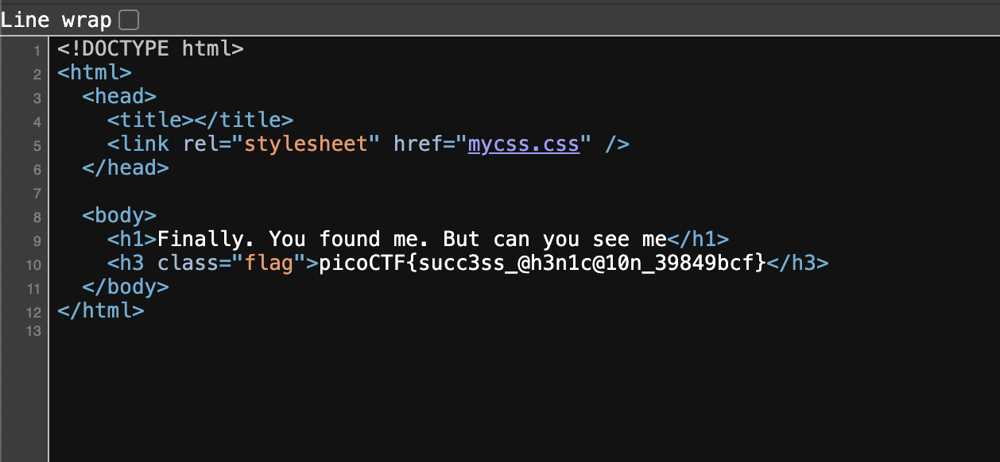

# Secrets

## Web Exploitation

### We have several pages hidden. Can you find the one with the flag?

#### Hint 1: folders, folders, folders

This is the landing page.


From the challenge description, we need to search for hidden directories.  Looking at the source, I see a few different directories:

```html
<!DOCTYPE html>
<html>
  <head>
    <meta charset="UTF-8" />
    <meta
      name="viewport"
      content="width=device-width, initial-scale=1, shrink-to-fit=no"
    />
    <meta name="description" content="" />
    <!-- Bootstrap core CSS -->
    <link href="vendor/bootstrap/css/bootstrap.min.css" rel="stylesheet" />   <----- vendor is a directory to investigate
    <!-- title -->
    <title>home</title>
    <!-- css -->
    <link href="secret/assets/index.css" rel="stylesheet" />    <----- secret is another one to investigate
  </head>
  <body>
    <!-- ***** Header Area Start ***** -->
    <div class="topnav">
      <a class="active" href="#home">Home</a>
      <a href="about.html">About</a>
      <a href="contact.html">Contact</a>
    </div>

    <div class="imgcontainer">
      
      <div class="top-left">
        <h1>If security wasn't your job, would you do it as a hobby?</h1>
      </div>
    </div>
  </body>
</html>
```

Trying `vendor` first:



Interesting, I looked for the CSS file and didn't find it.  I then went up the path and kept getting 404s.  Next, try the `secret` path.

I get a 200 status when getting the image from the secret/assets directory, but a 403 status when looking in the assets directory:


Moving back up the path, I tried the secret



Yes!  Progress.  The page doesn't have anything obvious.  Let's look at the source.



Okay, there's a directory called `hidden` in the `secret` directory.



Yikes!  This is ugly.   Before spending time trying to log in, let me look at the source



Alright!  There's yet another directory called `superhidden`.  Let's try that one



Ugh! :rage:  When will it end? Looking at the source :rage:



:joy:

**picoCTF{succ3ss_@h3n1c@10n_39849bcf}** 
