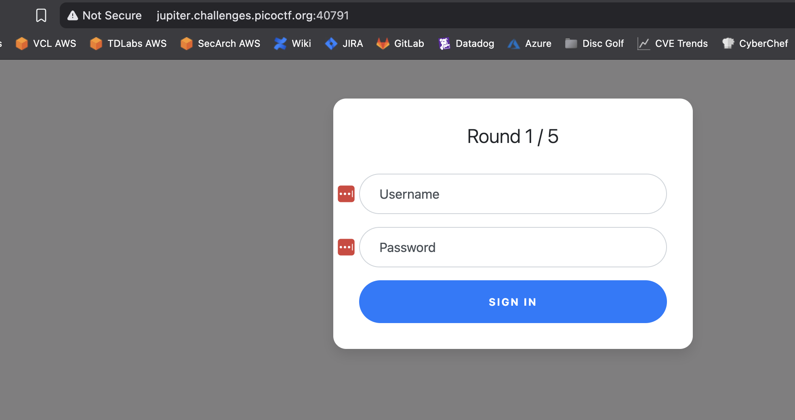
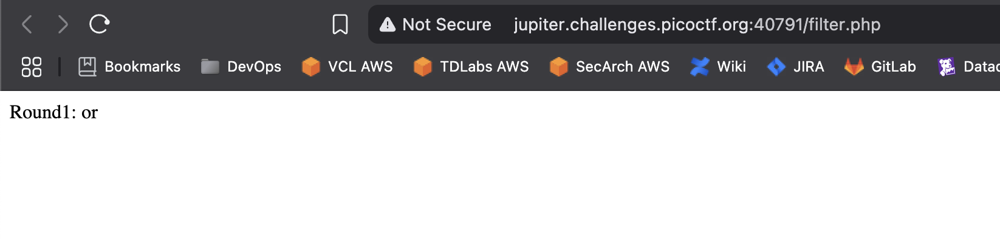
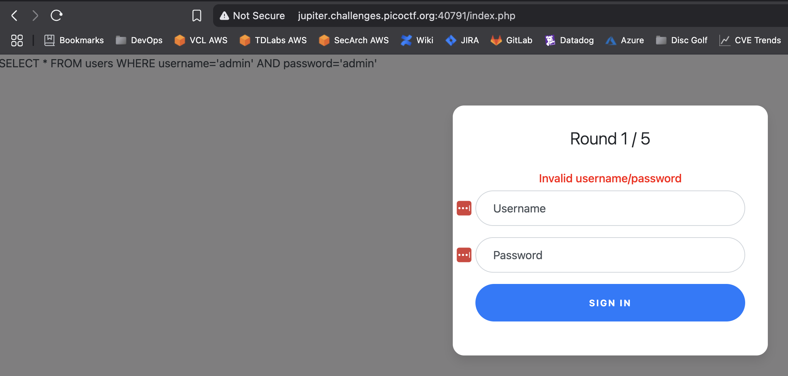
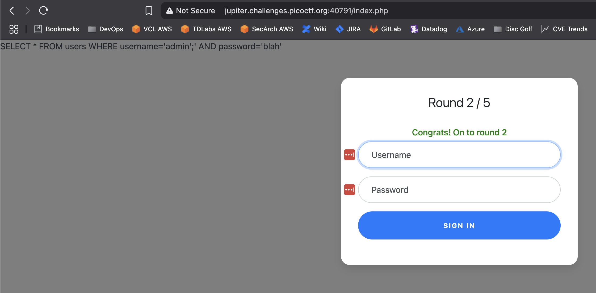
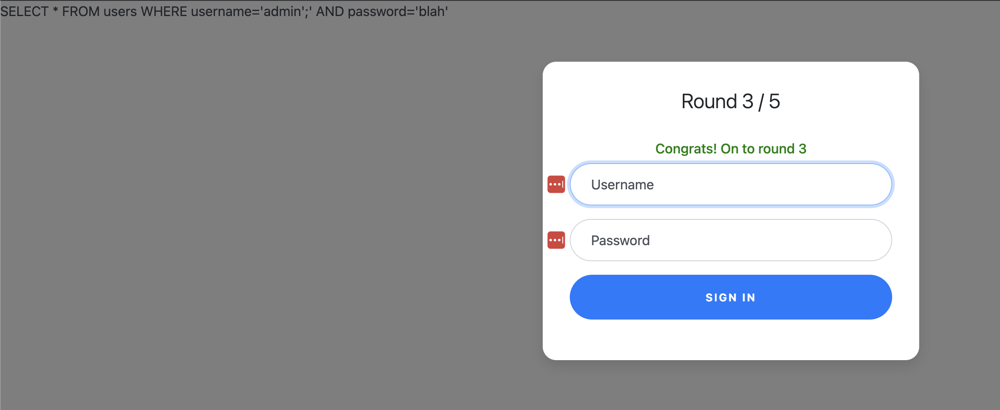
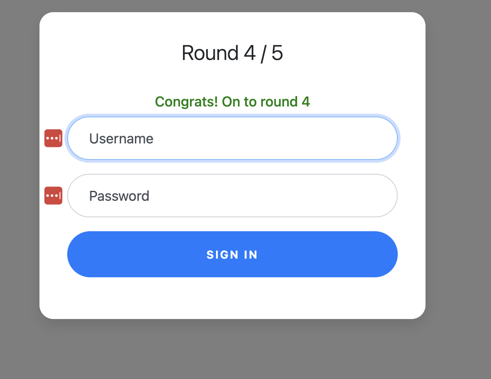
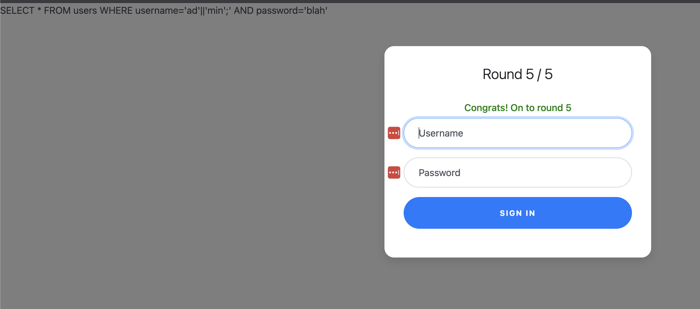
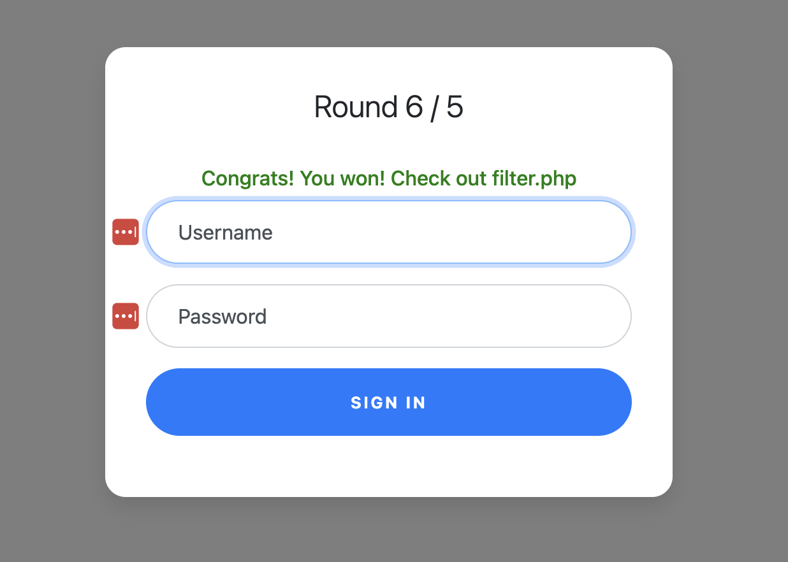

# Web Gauntlet

## Web Exploitation

### Can you beat the filters? Log in as admin

The challenge comes with two links.  The first is a logon page:



and a `filter.php` page which has what I assume is the blocked words:



At first I tried `admin` for the Username and Password fields and received the following:



This looks easy enough, let's try to insert the word `admin`, a single quote, and a semicolon to comment out the rest of the line.

That worked!  As you can see, the query created is exactly what was expected:



Off to Round 2! I refreshed the `filter.php` page and it updated to:


Looks like we can use the same syntax used for Round 1.



Yup! :joy:

Refreshing the `filter.php` revealed:

> Round3: or and = like > < --

And we can use the same query



Sweet, looking at the filter for Round 4 throws a wrench into using the same query:

> Round4: or and = like > < -- admin

Okay, since we can use the word `admin` to log in as admin, we need to break it up.

For SQLite we can use the `||` operator to concatenate two (or more) strings.  So for this one I'll use `ad'||'min'; for the username:



:joy: :joy: :joy:

On to Round 5, looking at the filter:

> Round5: or and = like > < -- union admin

We can use the same Username we used for Round4 (ad'||'min';)

Success!



And refreshing the `filter.php` page gives us the full PHP code and the flag!

```php
<?php
session_start();

if (!isset($_SESSION["round"])) {
    $_SESSION["round"] = 1;
}
$round = $_SESSION["round"];
$filter = array("");
$view = ($_SERVER["PHP_SELF"] == "/filter.php");

if ($round === 1) {
    $filter = array("or");
    if ($view) {
        echo "Round1: ".implode(" ", $filter)."<br/>";
    }
} else if ($round === 2) {
    $filter = array("or", "and", "like", "=", "--");
    if ($view) {
        echo "Round2: ".implode(" ", $filter)."<br/>";
    }
} else if ($round === 3) {
    $filter = array(" ", "or", "and", "=", "like", ">", "<", "--");
    // $filter = array("or", "and", "=", "like", "union", "select", "insert", "delete", "if", "else", "true", "false", "admin");
    if ($view) {
        echo "Round3: ".implode(" ", $filter)."<br/>";
    }
} else if ($round === 4) {
    $filter = array(" ", "or", "and", "=", "like", ">", "<", "--", "admin");
    // $filter = array(" ", "/**/", "--", "or", "and", "=", "like", "union", "select", "insert", "delete", "if", "else", "true", "false", "admin");
    if ($view) {
        echo "Round4: ".implode(" ", $filter)."<br/>";
    }
} else if ($round === 5) {
    $filter = array(" ", "or", "and", "=", "like", ">", "<", "--", "union", "admin");
    // $filter = array("0", "unhex", "char", "/*", "*/", "--", "or", "and", "=", "like", "union", "select", "insert", "delete", "if", "else", "true", "false", "admin");
    if ($view) {
        echo "Round5: ".implode(" ", $filter)."<br/>";
    }
} else if ($round >= 6) {
    if ($view) {
        highlight_file("filter.php");
    }
} else {
    $_SESSION["round"] = 1;
}

// picoCTF{y0u_m4d3_1t_96486d415c04a1abbbcf3a2ebe1f4d02}
?>
```

**picoCTF{y0u_m4d3_1t_96486d415c04a1abbbcf3a2ebe1f4d02}**


