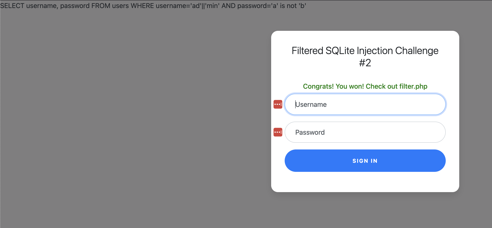

# Web Gauntlet 2

## Web Exploitation

### This website looks familiar... Log in as admin Site:

**NOTE: The solution for this is also the solution for Web Gauntlet 3**

Same landing page as Web Gauntlet(WG).  Checking out the filters:

> Filters: or and true false union like = > < ; -- /* */ admin

Well, damn!  SQLite has two comments and they are both filtered (; and --), so for this challenge the Password field is also in play.

From the WG challenge, we know we can use the `||` to make admin.  But for the Password field we need something that will return true.

Because `or`, `and`, `true` etc. are out of play I get negative thoughts.  And normally I would try to not dwell on them, but negatives are the answer!

We can use something like `a' is not 'z` because this will be true!  



```php
<?php
session_start();

if (!isset($_SESSION["winner2"])) {
    $_SESSION["winner2"] = 0;
}
$win = $_SESSION["winner2"];
$view = ($_SERVER["PHP_SELF"] == "/filter.php");

if ($win === 0) {
    $filter = array("or", "and", "true", "false", "union", "like", "=", ">", "<", ";", "--", "/*", "*/", "admin");
    if ($view) {
        echo "Filters: ".implode(" ", $filter)."<br/>";
    }
} else if ($win === 1) {
    if ($view) {
        highlight_file("filter.php");
    }
    $_SESSION["winner2"] = 0;        // <- Don't refresh!
} else {
    $_SESSION["winner2"] = 0;
}

// picoCTF{0n3_m0r3_t1m3_b55c7a5682db6cb0192b28772d4f4131}
?>
```

**picoCTF{0n3_m0r3_t1m3_b55c7a5682db6cb0192b28772d4f4131}**
