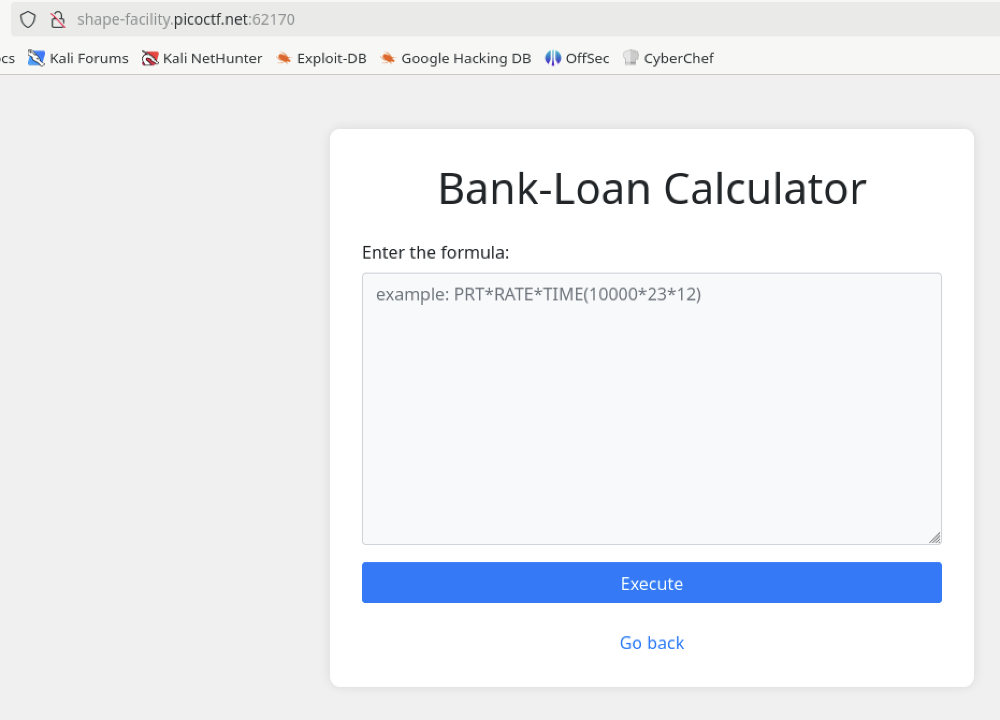
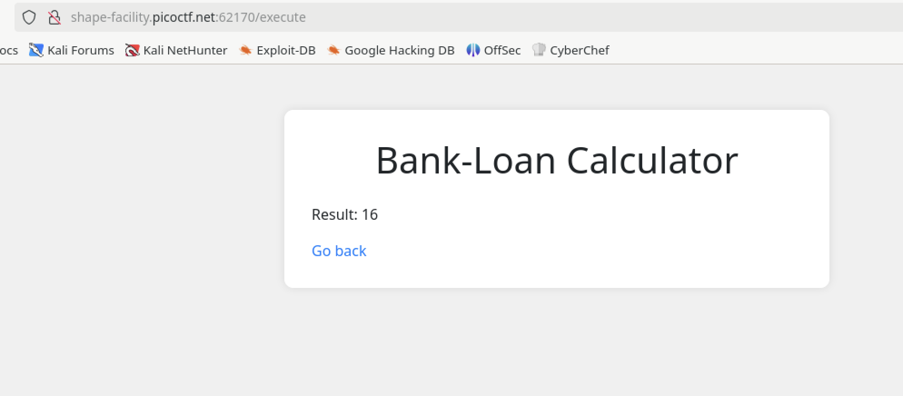
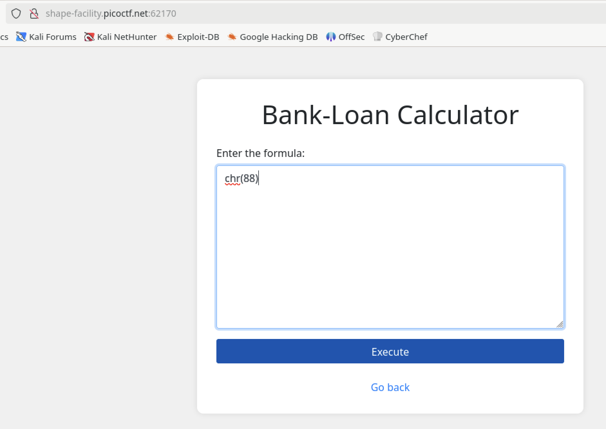
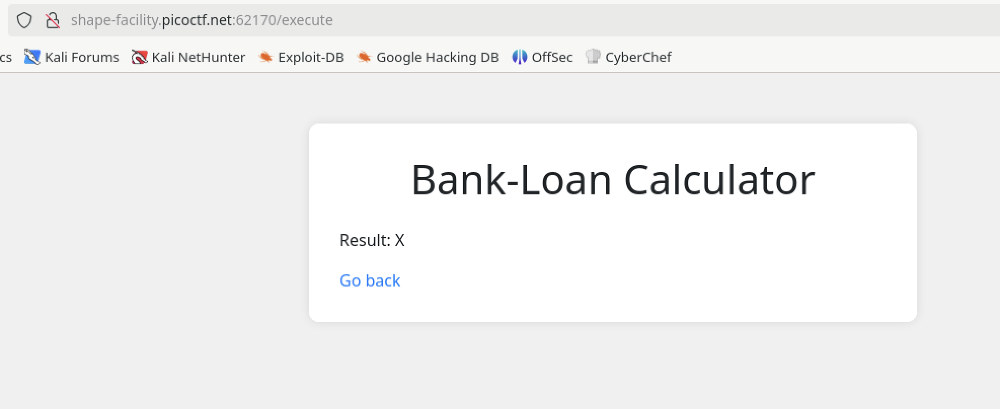
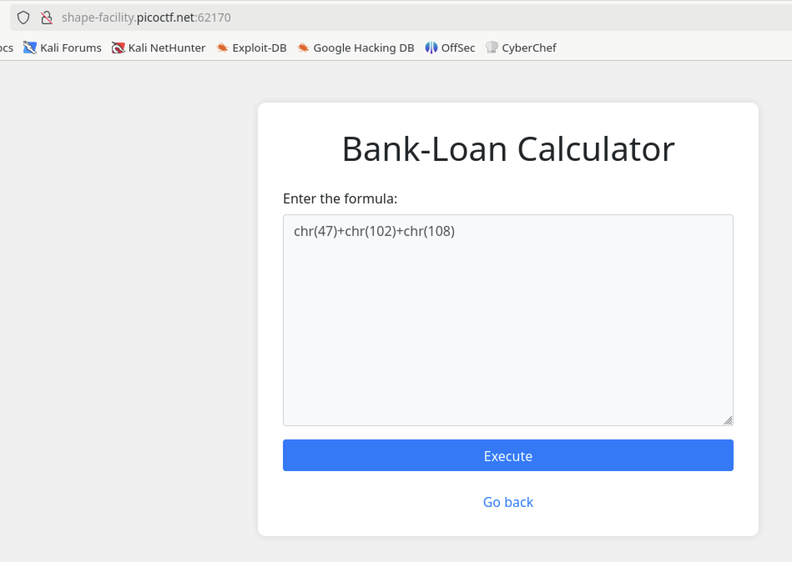
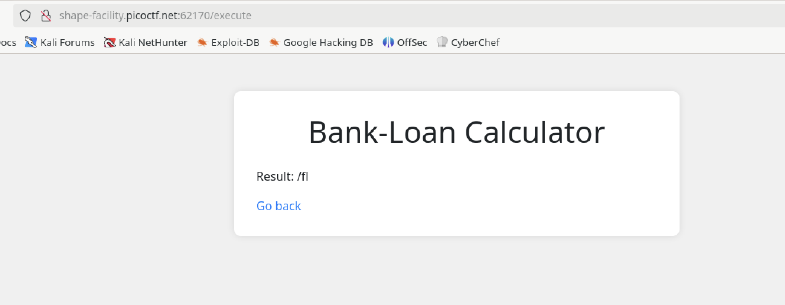
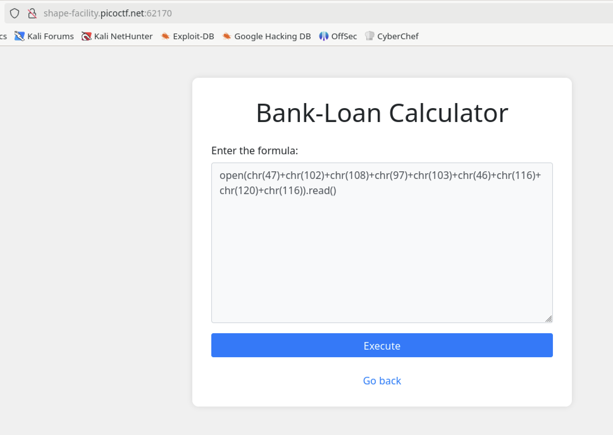
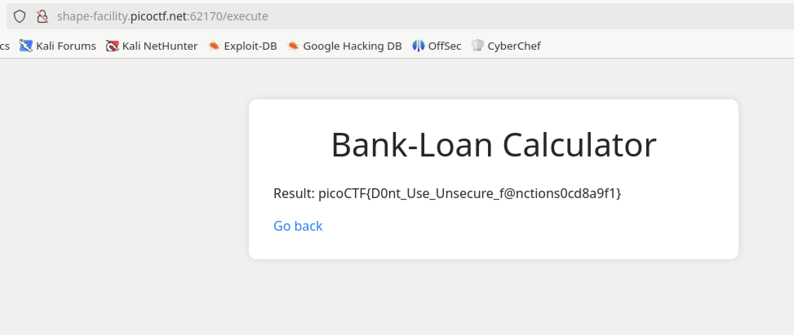

# 3v@l

## Web

### ABC Bank's website has a loan calculator to help its clients calculate the amount they pay if they take a loan from the bank. Unfortunately, they are using an eval function to calculate the loan. Bypassing this will give you Remote Code Execution (RCE). Can you exploit the bank's calculator and read the flag?

#### Hints
- Bypass regex
- The flag file is /flag.txt
- You might need encoding or dynamic construction to bypass restrictions.



I tried something simple by evaluating "4*4"



Before going to far down the rabbit hole, I checked the source code and found:

```html
<!--
    TODO
    ------------
    Secure python_flask eval execution by 
        1.blocking malcious keyword like os,eval,exec,bind,connect,python,socket,ls,cat,shell,bind
        2.Implementing regex: r'0x[0-9A-Fa-f]+|\\u[0-9A-Fa-f]{4}|%[0-9A-Fa-f]{2}|\.[A-Za-z0-9]{1,3}\b|[\\\/]|\.\.'
-->
```

Okay, the web page is using the Python eval function.  This is dangerous.  It's blocking a lot of things, but not all.

Since eval will execute a string as a Python expression, we can use `open` and `read`, but the regex will catch hex, unicode, url-encoded characters, any file extension between 1 and 3 characters (.xxx), any forward or backslash, and two periods in a row `..`.

But what it doesn't exclude is printable characters (other than the periods), including parentheses.

First, I checked if I could use the `chr` command to convert a decimal value to a character.



And it worked!



Then I tested if I could use a forward slash since it was being blocked.



And that worked too!



Now to combine it with an `open` and `read` command.



And viola!



**picoCTF{D0nt_Use_Unsecure_f@nctions0cd8a9f1}**


