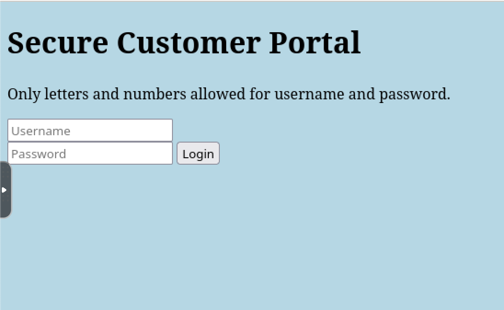
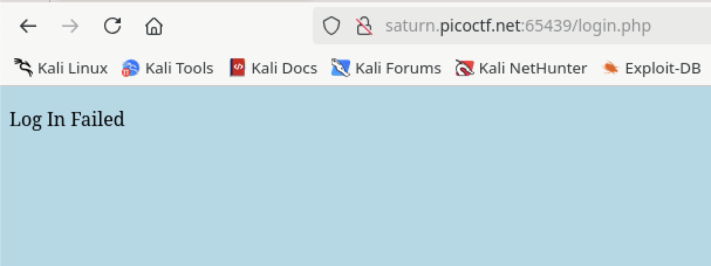
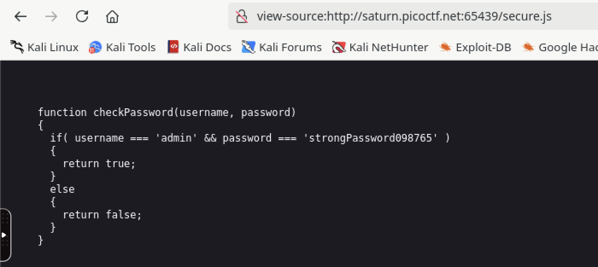
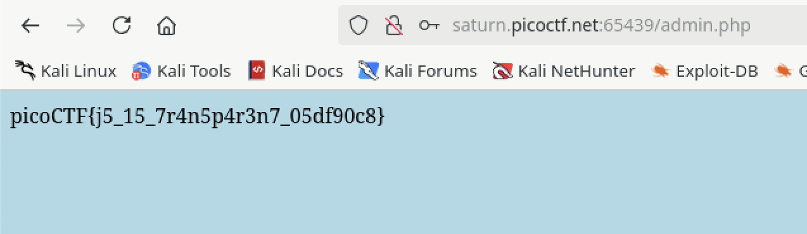

# Local Authority

## Web

### Can you get the flag?

The landing page has login/password fields.



The source code indicates that it hits login.php, but there is no further information to go on.

```html
<!DOCTYPE html>
<html lang="en">
  <head>
    <meta charset="UTF-8">
    <meta name="viewport" content="width=device-width, initial-scale=1.0">
    <meta http-equiv="X-UA-Compatible" content="ie=edge">
    <link rel="stylesheet" href="style.css">
    <title>Secure Customer Portal</title>
  </head>
  <body>

    <h1>Secure Customer Portal</h1>
    
   <p>Only letters and numbers allowed for username and password.</p>
    
    <form role="form" action="login.php" method="post">
      <input type="text" name="username" placeholder="Username" required 
       autofocus></br>
      <input type="password" name="password" placeholder="Password" required>
      <button type="submit" name="login">Login</button>
    </form>
  </body>
</html>
```

Let's try admin:admin...



Okay, it drops us in login.php... let me look at the source.

```html
<!DOCTYPE html>
<html lang="en">
  <head>
    <meta charset="UTF-8">
    <meta name="viewport" content="width=device-width, initial-scale=1.0">
    <meta http-equiv="X-UA-Compatible" content="ie=edge">
    <link rel="stylesheet" href="style.css">
    <title>Login Page</title>
  </head>
  <body>
    <script src="secure.js"></script>
    
    <p id='msg'></p>
    
    <form hidden action="admin.php" method="post" id="hiddenAdminForm">
      <input type="text" name="hash" required id="adminFormHash">
    </form>
    
    <script type="text/javascript">
    [REST REDACTED TO SAVE SPACE]
```

That script looks interesting...



W00t! :joy: :joy:

Return to the landing page and use the provided credentials.



**picoCTF{j5_15_7r4n5p4r3n7_05df90c8}**
