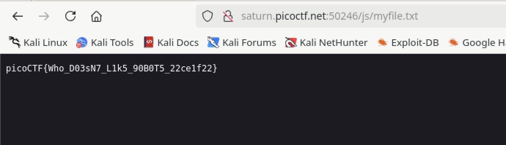

# Sans Roboto

## Web

### The flag is somewhere on this web application not necessarily on the website. Find it.


Scrolling through the code, I found:

```html
            <!-- six_box
            end six_box   The flag is not here but keep digging :)-- >

            <!-- We Do Yogas -->
```

Given the name of the challenge, I checked the 'robots.txt' file and found:

```text
User-agent *
Disallow: /cgi-bin/
Think you have seen your flag or want to keep looking.

ZmxhZzEudHh0;anMvbXlmaW
anMvbXlmaWxlLnR4dA==
svssshjweuiwl;oiho.bsvdaslejg
Disallow: /wp-admin/
```
Two of those lines definitely look like base64 encoding. The first encoded line looked promising but jumbled.  Trying the second line:


This produced something more interesting.  That's a good sign!  Putting that in the URL...



:joy:

**picoCTF{Who_D03sN7_L1k5_90B0T5_22ce1f22}**
