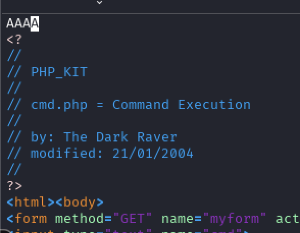
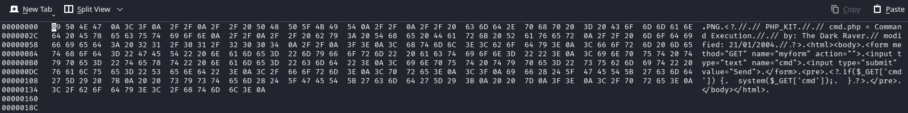
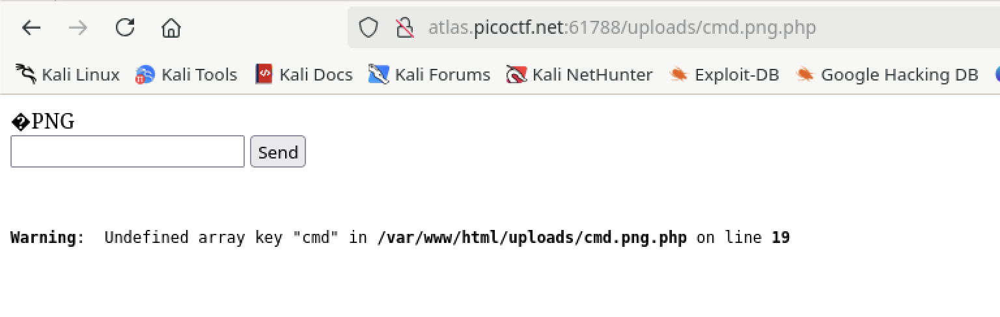
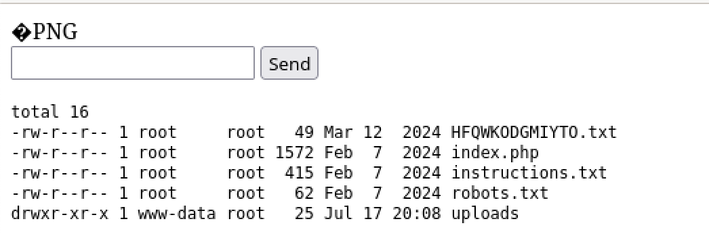
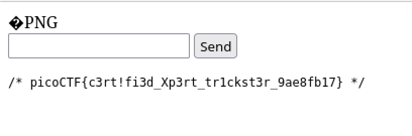

# Trickster

## Web

### I found a web app that can help process images: PNG images only!


Well, let's try to upload the cmd.php file we used for n0s4n1ty1...


```html
<!DOCTYPE html>
<html>
<head>
    <title>File Upload Page</title>
</head>
<body>
    <h1>Welcome to my PNG processing app</h1>

    Error: File name does not contain '.png'.
    <form method="POST" enctype="multipart/form-data">
        <input type="file" name="file" accept=".png">
        <input type="submit" value="Upload File">
    </form>
</body>
</html>
```
The error message is suspect.  Let's add a .png to the file....but not at the end.


Okay, while it didn't work we have a different error message.  These look like hex characters.  Looking at them in CyberChef, I see that it's the first four characters of the file!


There are probably easier ways of doing the next part but I'm going to add four characters to the beginning of the file:



then in `hexedit` convert them to the first four values of a PNG file.




Now to try another upload.


But where to find the file.  I took a stab that it was in the root.  It was not.  Then I tried adding 'uploads' to the path and it worked.



I did an `ls` and it gave me the file name.  After that, I tried `sudo -l` and it didn't return anything.  Then I went tried to `ls /root` and it also didn't return anything.  I decided to go up a level to see what was there:



That file with the scrambled name looks promising.



:joy:

**picoCTF{c3rt!fi3d_Xp3rt_tr1ckst3r_9ae8fb17}**

P.S.

I went back and reviewed some of the other documents that were in the directory of the flag.  If you look at the 'robots.txt' file it give some clues.

```txt
User-agent: *
Disallow: /instructions.txt
Disallow: /uploads/
```

And looking at the 'instructions.txt' it contains:

```txt
Let's create a web app for PNG Images processing.
It needs to:
Allow users to upload PNG images
	look for ".png" extension in the submitted files
	make sure the magic bytes match (not sure what this is exactly but wikipedia says that the first few bytes contain 'PNG' in hexadecimal: "50 4E 47" )
after validation, store the uploaded files so that the admin can retrieve them later and do the necessary processing.
```
I guessed it all but this would have made it flow a bit quicker.


**picoCTF{c3rt!fi3d_Xp3rt_tr1ckst3r_9ae8fb17}**
