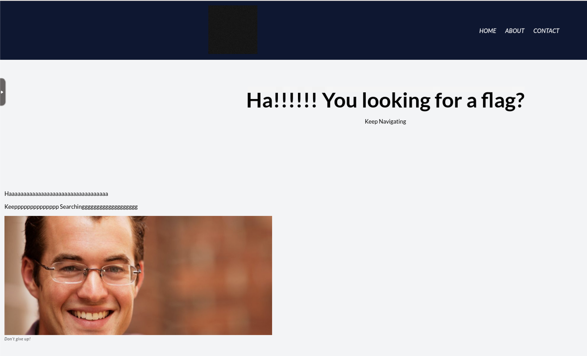
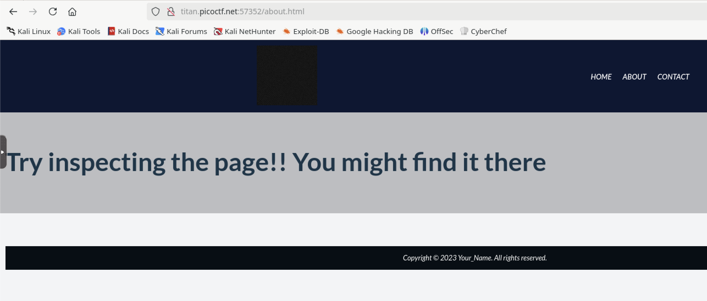
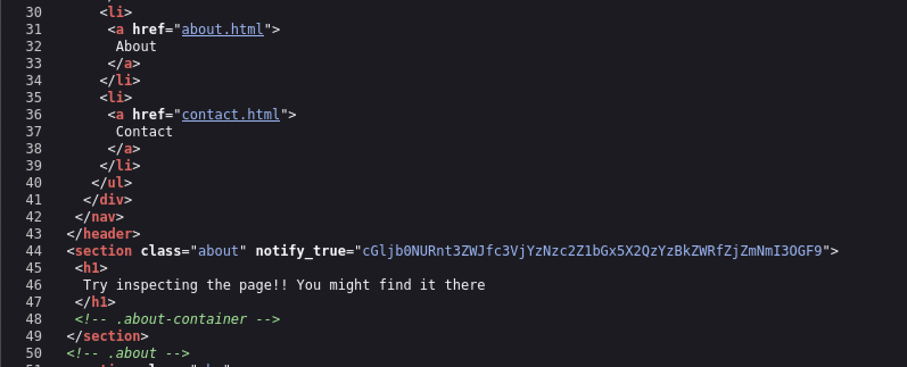
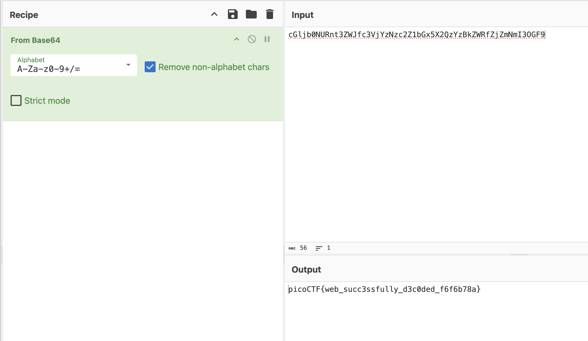

# WebDecode

## Web

### Do you know how to use the web inspector?

The opening page didn't have much.

I looked at the page source but didn't see anything of value.
I normally click on all the links to see what else is available.  Clicking on the About page shows the following:

This made me want to see the source.

Line 44 appears to be base64 encoding, so I'm off to CyberChef.

**picoCTF{web_succ3ssfully_d3c0ded_f6f6b78a}**
