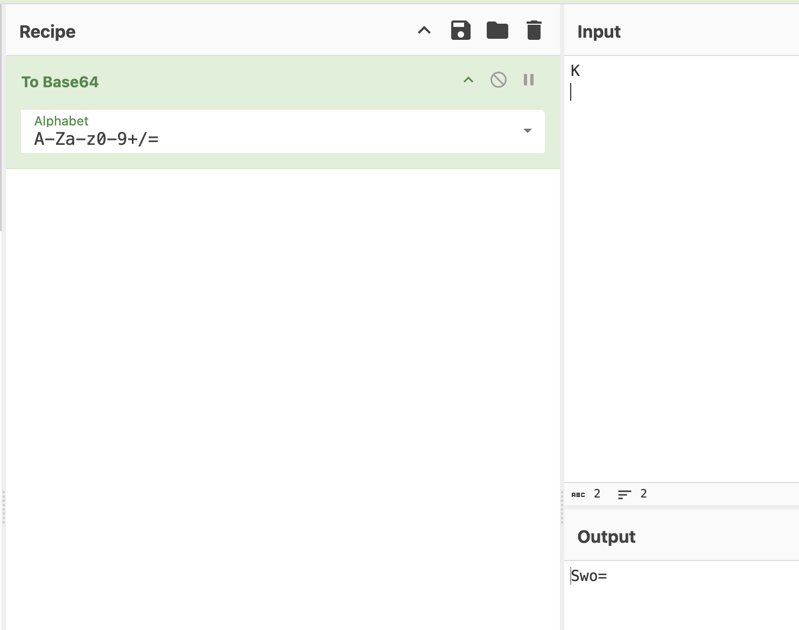

#interencdec

## Cryptography

### Can you get the real meaning from this file.

The challenge comes with a file.  It looked like a Base64 encoded string.  Jump ahead if you don't need a Base64 description.

[Base64](https://en.wikipedia.org/wiki/Base64) encoding allows sending binary data as text, which can be reversed back to its original binary format.  In brief, data is usually 8-bits, allowing for 256 different characters.  Transmitting non-printable characters can be problematic in e-mail or the web.  Base64 solves this by encoding the 8-bit value as 6-bits and those six bits correspond to the base64 alphabet defined in RFC 4648.  Confusing right?  Let me show an example.

The letter K in [ASCII](https://www.asciitable.com/) has a value of 75 decimal.  This translates to 01001011 in binary.  Base64 takes the first 6 bytes (010010) and matches that value (18) with the RFC4648 table.  This corresponds with the letter 'S'.  The remaining two bytes (11) are padded with 0's at the end to make 6-bits (110000).  This is 48 in decimal and corresponds to the letter 'w' in the RFC4648 table. Last, we need to account for the four bits of padding we added, every two bits of padding is represented by an equal sign.  So putting it all together, the letter 'K' in ASCII would be represented as 'Sw==' in Base64.

Great, we just made one character four!  Why?  Well because not all bytes are printable.  Take a new line (\n) character for example.  That is 10 decimal in ASCII, it's not printable, and sending it in raw form may be interpreted by a browser, or email as the enter key being pressed. But we have to send it, that's where Base64 comes in.  Let's send the letter K with a return this time.  As before, the K is 01001011 and the new line will be 00001010.  Now append the new line and we have 0100101100001010.  As before, the first six bytes will be 010010 which translates to 'S'.  But now we have ten characters left instead of two as before.  Interestingly, the second character is the same as the before because the new line character starts with four 0's.  This time we have 1010 left over, and we have to pad it with two 0's to make six characters.  101000 this equates to 40 decimal which translates to the letter 'o'.  Since we added two 0's as padding we need to add an '=' to the end.  So two characters 'K\n' would be sent as 'Swo=' in Base64.




Running it through `base64` decoding revealed another string that looked like base64 but was wrapped in Python byte string format.

```sh
$ cat enc_flag 
YidkM0JxZGtwQlRYdHFhR3g2YUhsZmF6TnFlVGwzWVROclgyZzBOMm8yYXpZNWZRPT0nCg==

(lsiopy) abc@ffce7aecc25b:~$ base64 -d enc_flag
b'd3BqdkpBTXtqaGx6aHlfazNqeTl3YTNrX2g0N2o2azY5fQ=='
```

If you remove the b'' wrapper, this is just another base64 encoding.

```sh
% echo d3BqdkpBTXtqaGx6aHlfazNqeTl3YTNrX2g0N2o2azY5fQ== |base64 -d
wpjvJAM{jhlzhy_k3jy9wa3k_h47j6k69}
```
Okay!  This looks familiar.  Off to CyberChef...

[Flag](./flag.png)

**picoCTF{caesar_d3cr9pt3d_a47c6d69}**

