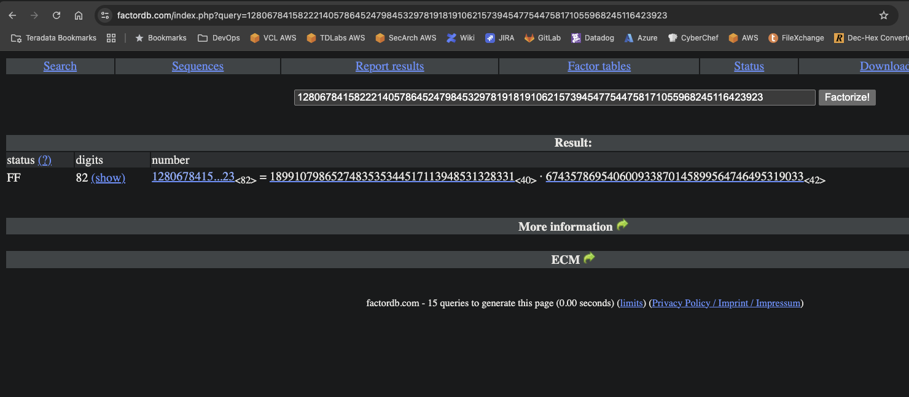

# Mind Your P's and Q's

## Cryptography

### In RSA, a small e value can be problematic, but what about N? Can you decrypt this? values

You can download the file which contains:

```sh
$ cat values 
Decrypt my super sick RSA:
c: 62324783949134119159408816513334912534343517300880137691662780895409992760262021
n: 1280678415822214057864524798453297819181910621573945477544758171055968245116423923
e: 65537
```

First because 'n' is small we can use [factordb.com](https://factordb.com) to figure out p and q.



from this we can say:
p = 1899107986527483535344517113948531328331
q = 674357869540600933870145899564746495319033

```python
#!/usr/bin/env python3

from sympy import mod_inverse, isprime

n = int(1280678415822214057864524798453297819181910621573945477544758171055968245116423923)
p = int(1899107986527483535344517113948531328331)
q = int(674357869540600933870145899564746495319033)
ct = int(62324783949134119159408816513334912534343517300880137691662780895409992760262021)
e = int(65537)

if isprime(p) and isprime(q):
    phi = (p-1)*(q-1)
    d = mod_inverse(e, phi)
    dt = pow(ct, d, n)
    dec_str = dt.to_bytes((dt.bit_length() + 7) // 8 , byteorder = "big")
    print(dec_str.decode())
else:
    print("ruhroh")
```


This way is a bit easier:

```sh
$ docker run -it --rm rsactftool_full -n 1280678415822214057864524798453297819181910621573945477544758171055968245116423923 -e 65537 --decrypt 62324783949134119159408816513334912534343517300880137691662780895409992760262021
private argument is not set, the private key will not be displayed, even if recovered.
['/tmp/tmp7dql6baf']

[*] Testing key /tmp/tmp7dql6baf.
attack initialized...
attack initialized...
[*] Performing system_primes_gcd attack on /tmp/tmp7dql6baf.
100%|███████████████████████████████████████████████████████████████████████████████████████████████████████████████| 7007/7007 [00:00<00:00, 693491.78it/s]
[+] Time elapsed: 0.0797 sec.
[*] Performing mersenne_primes attack on /tmp/tmp7dql6baf.
 24%|███████████████████████████                                                                                        | 12/51 [00:00<00:00, 106409.40it/s]
[+] Time elapsed: 0.0019 sec.
[*] Performing pastctfprimes attack on /tmp/tmp7dql6baf.
[+] Time elapsed: 0.0012 sec.
[*] Performing rapid7primes attack on /tmp/tmp7dql6baf.
[+] Time elapsed: 0.0008 sec.
[*] Performing smallq attack on /tmp/tmp7dql6baf.
[+] Time elapsed: 0.3622 sec.
[*] Performing factordb attack on /tmp/tmp7dql6baf.
[*] Attack success with factordb method !
[+] Total time elapsed min,max,avg: 0.0008/0.3622/0.0892 sec.

Results for /tmp/tmp7dql6baf:

Decrypted data :
HEX : 0x007069636f4354467b736d6131315f4e5f6e305f67306f645f30353031323736377d
INT (big endian) : 13016382529449106065927291425342535437996222135352905256639555654677400177227645
INT (little endian) : 3711739942918996135095564070444078210974633154646265969428826141271237837554544640
utf-8 : picoCTF{sma11_N_n0_g0od_05012767}
utf-16 : 瀀捩䍯䙔獻慭ㄱ也湟弰で摯た〵㈱㘷紷
STR : b'\x00picoCTF{sma11_N_n0_g0od_05012767}'
```

**picoCTF{sma11_N_n0_g0od_05012767}**
