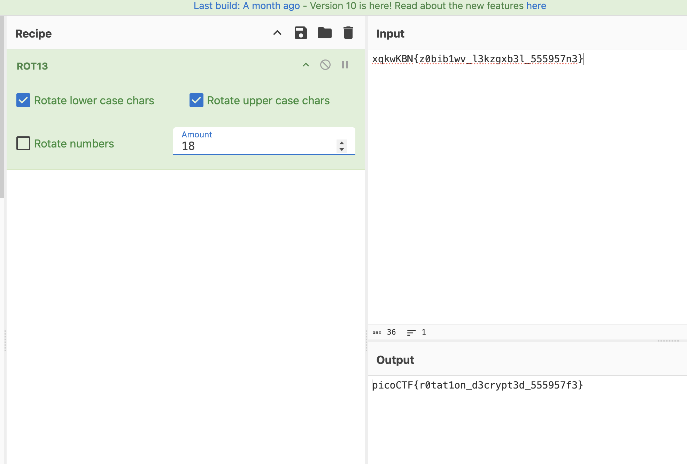

# Rotation

## Cryptography

### You will find the flag after decrypting this file

The challenge has a file.  I downloaded it by using `wget`

```sh
$ cat encrypted.txt 
xqkwKBN{z0bib1wv_l3kzgxb3l_555957n3}
```

Because it's in a recognizable pattern of a flag, I think this is a substitution cipher. In particular, because of the name of the challenge, a rotation cipher.  A rotation cipher, usually referred to as [ROT13](https://en.wikipedia.org/wiki/ROT13), is a substitution cipher.  Letters of the plain text are substituted in a known pattern.  ROT13 repositions the characters in the alphabet by 13 characters, and then writes the text using the letters that took it's place.  For example, if characters were rotated by 1 the alphabet would shift one.  ABC would be encrypted as NOP

ABCDEFGHIJKLMNOPQRSTUVWXYZ - ROT0
NOPQRSTUVWXYZABCDEFGHIJKLM - ROT13

To check if it's a rotation cipher, I'd expect that the distance between the first two characters would be the same as the first two characters of the beginning of the flag.  In other words, the distance between 'x' and 'q' should be the same distance as 'p' and 'i' (picoctf{...):

```sh
>>> ord('p') - ord('i')
7
>>> ord('x') - ord('q')
7
```

Yes, it's likely a ROT cipher.  Next, I used `CyberChef`.  I used the ROT13 recipe, but found that didn't decrypt the flag.  I needed to make it a ROT18 rotation and got the flag.



**picoCTF{r0tat1on_d3crypt3d_555957f3}**
