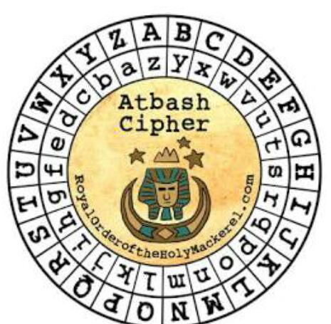
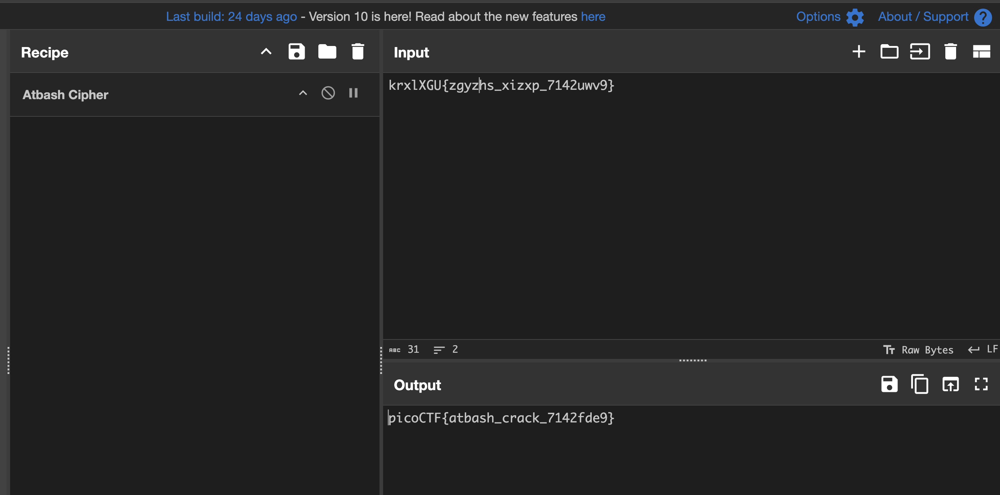

# HideToSee

## Crypto

### How about some hide and seek heh?

This challenge comes with the following file:



```sh
$ file atbash.jpg
atbash.jpg: JPEG image data, JFIF standard 1.01, aspect ratio, density 1x1, segment length 16, baseline, precision 8, 465x455, components 3

$ exiftool atbash.jpg
ExifTool Version Number         : 13.10
File Name                       : atbash.jpg
Directory                       : .
File Size                       : 52 kB
File Modification Date/Time     : 2023:03:16 03:16:32+00:00
File Access Date/Time           : 2025:03:17 20:22:12+00:00
File Inode Change Date/Time     : 2025:03:06 17:48:31+00:00
File Permissions                : -rw-r--r--
File Type                       : JPEG
File Type Extension             : jpg
MIME Type                       : image/jpeg
JFIF Version                    : 1.01
Resolution Unit                 : None
X Resolution                    : 1
Y Resolution                    : 1
Image Width                     : 465
Image Height                    : 455
Encoding Process                : Baseline DCT, Huffman coding
Bits Per Sample                 : 8
Color Components                : 3
Y Cb Cr Sub Sampling            : YCbCr4:2:0 (2 2)
Image Size                      : 465x455
Megapixels                      : 0.212
```
Nothing interesting so far.

I tried Aperi'Solve but it wasn't working for some reason...moving on!

```sh
$ stegseek --crack -sf atbash.jpg
StegSeek 0.6 - https://github.com/RickdeJager/StegSeek

[i] Found passphrase: ""
[i] Original filename: "encrypted.txt".
[i] Extracting to "atbash.jpg.out".
```

Yes! Let's get the flag...

```sh
$ cat atbash.jpg.out 
krxlXGU{zgyzhs_xizxp_7142uwv9}
```

Anticlimactic!

Well, the title of the file and the image are pretty much the clues we need.  [Here's the wiki page](https://en.wikipedia.org/wiki/Atbash).  I let CyberChef do the heavy lifting:



**picoCTF{atbash_crack_7142fde9}**
