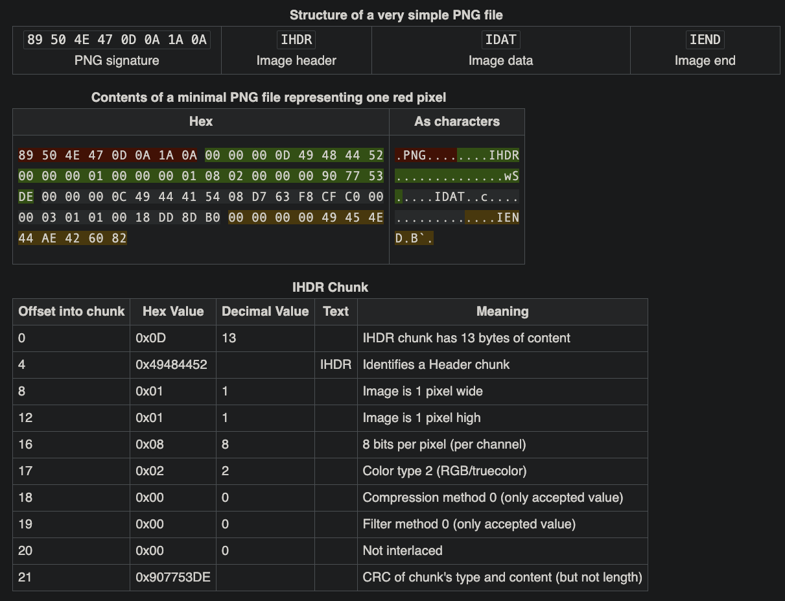

# c0rrupt

## Forensics

### We found this file. Recover the flag.

Download the file and

```sh
% file mystery
mystery: data

% exiftool mystery
ExifTool Version Number         : 13.10
File Name                       : mystery
Directory                       : .
File Size                       : 203 kB
File Modification Date/Time     : 2020:10:26 14:30:20-04:00
File Access Date/Time           : 2025:03:17 13:04:44-04:00
File Inode Change Date/Time     : 2025:03:17 13:04:44-04:00
File Permissions                : -rw-r--r--
Error                           : Unknown file type
```

Oooh, an enigma

Opening this up in `hexedit` to see if I can tease anything out of it.


Interesting, from looking at some of the hex dump it looks like this could be a PNG file.  The sRGB, gAMA, pHYs are the clues I'm seeing.  Let's use `pngcheck` to see what's up.

```sh
$ pngcheck mystery 
mystery  this is neither a PNG or JNG image nor a MNG stream
ERROR: mystery
```
Hmmm, well maybe if we correct the signature it will clear it up.  There are a lot of references for PNG file format.  I always start with the [Wikipedia](https://en.wikipedia.org/wiki/PNG) reference because it's the simplest.


Now lets change the first 8 bytes to match in the mystery file.


And `pngcheck` again.

```sh
$ pngcheck mystery 
mystery:  invalid chunk name "C"DR" (43 22 44 52)
ERROR: mystery
```

Cool, now it sees it as a PNG file but it's saying there a corrupt chunk. But which one?  Back to the wiki


IDHR is definitely corrupt.  Let's dig into it.



Well it needs to start with IHDR and the first two characters are corrupt.


I changed the 43 22 to 49 48 and saved the file, once more to `pngcheck`

```sh
$ pngcheck mystery 
mystery  CRC error in chunk pHYs (computed 38d82c82, expected 495224f0)
ERROR: mystery

```

Progress!  Now there's a CRC error.  CRC stands for Cyclic Redundancy Check.  It checks if there's errors in data.  Too long to explain here, it's a good indicator that a size or maybe even the CRC itself is corrupt in pHYs.  We'll also need a new reference since pHYs isn't included in Wikipedia.  [This one](https://www.w3.org/TR/REC-png-961001#C.pHYs) from W3.org will help.

First, let me back up a bit.  A Chunk has a specific format.  It starts with a 4-byte length, which only counts the data field, and not itself.  Next is the Chunk type.  We've already worked with IDHR, and now we're working with the pHYs type.  Third is the Chunk Data.  The size depends on the type.  The last part is the CRC.

Here are the details for `pHYs`


This chunk has the 4-byte header, the Type (pHYs), 4-bytes each for the X and Y axis size of the image, a one-byte Unit specifier (can only be 0 or 1), and the CRC.


The header is correct, 00 00 00 09 matches the 4-bytes each for X & Y and the 1-byte for the Unit.  The Type is write 70 48 59 73 are the hex values for pHYs.  The X and Y sizes don't match.  That's not necessary but seeing as X is AA 00 16 25 and Y is 00 00 16 25, I'm think this is meant to be a square image.  Finally, the Unit specifier is a 1 which is allowed and the CRC is the CRC.  Doing some quick math (with the help of python), 0xAA001625 equates to 2.8 billion pixels!?!, where 0x1625 seems to be a more manageable 5669 pixels.  Let's change AA to 00 and see what happens.

```sh
$ pngcheck mystery 
mystery  invalid chunk length (too large)
ERROR: mystery
```

Damn, I was hoping that was it.  Once more unto the breach, dear friends, once more.  (honestly, did you think Shakespeare would find his way into your day when you woke up this morning?)

```sh
$ pngcheck -v mystery
File: mystery (202940 bytes)
  chunk IHDR at offset 0x0000c, length 13
    1642 x 1095 image, 24-bit RGB, non-interlaced
  chunk sRGB at offset 0x00025, length 1
    rendering intent = perceptual
  chunk gAMA at offset 0x00032, length 4: 0.45455
  chunk pHYs at offset 0x00042, length 9: 5669x5669 pixels/meter (144 dpi)
:  invalid chunk length (too large)
ERRORS DETECTED in mystery
```
The following is a verbose output of `pngcheck`.  We're until after the pHYs type.  From experience, I noticed there isn't an IDAT following the pHYs.  This is where I'm focused.  


I'm not sure the AA at the end of the pHYs is supposed to be there, but first I want to focus on fixing the IDAT spelling.  I fixed the spelling and got the same error, which makes me think the Chunk Length is too big.  On larger images, there are multiple IDAT chunks.  This allows images to load faster.  I would expect all but the last IDAT chunk to be the same size.

From the search I found the second and third IDAT entries both had the same size.


The last idat value was smaller because it was at the end of the file.  I'm going to change the size of the first one to 00 00 FF F4.

NOTE!  Hello!  It's me from the future!  Doing that last action leads to so much pain.  All that's needed is to change the first two bytes from AA AA to 00 00. Read on to see the consequences of your actions.

```sh
$ pngcheck  mystery
mystery  CRC error in chunk IDAT (computed 97d67a64, expected 613ac4c8)
ERROR: mystery
```
😡

Okay, it found a CRC of 613ac4c8.  Let's look for that.


I blew way past it.  But why?  After noodling this for a few minutes it came to me.  The IDAT chunks are evenly spaced but the first one already has data ahead of it.  The Chunk Length for the first IDAT starts at 0x53, not 0.  So subtracting 0xfff4 - 0x53 we get 0xffa1.  Onward!

```sh
$ pngcheck  mystery
mystery  CRC error in chunk IDAT (computed a921f5dc, expected 28695304)
ERROR: mystery
```

:rage: :cursing_face: 😡:

What did I forget this time?  Searching for 28695304


Now I'm 4-bytes short?  FFS, because the Chunk Length doesn't count itself.  I should have started the counting at 0x4F because the chunk doesn't count it's length field.  0xfff4 - 0x4f is 0xffa5.  After the changes, survey says?

```sh
$ pngcheck  mystery
OK: mystery (1642x1095, 24-bit RGB, non-interlaced, 96.3%).
```
😂:


**picoCTF{c0rrupt10n_1847995}**


