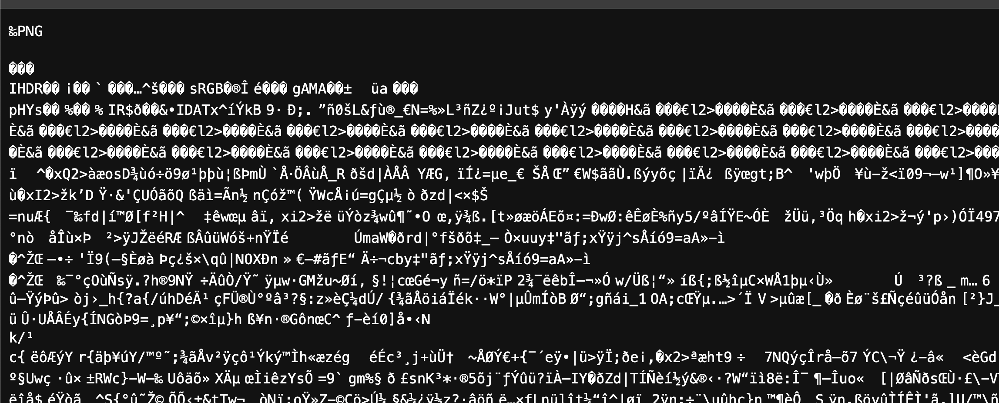
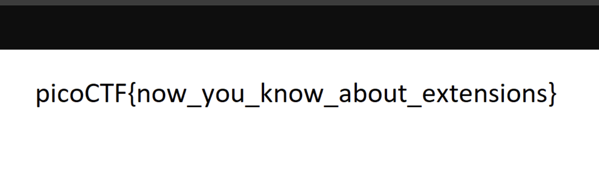

# extensions

## Forensics

### This is a really weird text file TXT? Can you find the flag?

```sh
% file flag.txt
flag.txt: PNG image data, 1697 x 608, 8-bit/color RGB, non-interlaced
```
Can we open it in a browser?




Yikes! Nope!  Not right.  Let's see what happens when we change the extension.

```sh
cp flag.txt flag.png
```



**picoCTF{now_you_know_about_extensions}**


