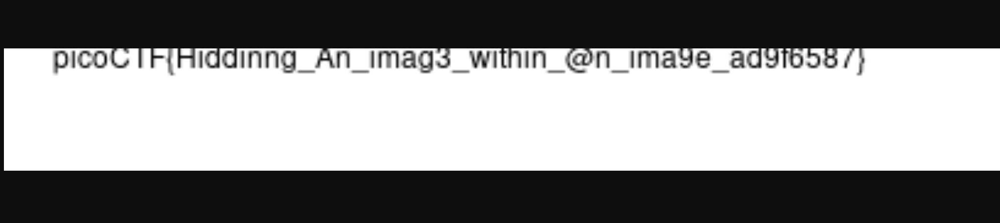

# hideme

## Forensics

### Every file gets a flag.  The SOC analyst saw one image been sent back and forth between two people. They decided to investigate and found out that there was more than what meets the eye here.

The challenge comes with an image file.

Let's see if it's really an image.

```sh
% file flag.png
flag.png: PNG image data, 512 x 504, 8-bit/color RGBA, non-interlaced
```
Let's check the metadata.

```sh
% exiftool flag.png
ExifTool Version Number         : 13.10
File Name                       : flag.png
Directory                       : .
File Size                       : 43 kB
File Modification Date/Time     : 2023:03:15 23:16:13-04:00
File Access Date/Time           : 2025:03:17 12:46:56-04:00
File Inode Change Date/Time     : 2025:03:17 12:46:02-04:00
File Permissions                : -rw-r--r--
File Type                       : PNG
File Type Extension             : png
MIME Type                       : image/png
Image Width                     : 512
Image Height                    : 504
Bit Depth                       : 8
Color Type                      : RGB with Alpha
Compression                     : Deflate/Inflate
Filter                          : Adaptive
Interlace                       : Noninterlaced
Warning                         : [minor] Trailer data after PNG IEND chunk
Image Size                      : 512x504
Megapixels                      : 0.258
```

The only thing interesting seems to be that warning.  Let's open the file in a browser and see what's what.


Not much help there.  Next step is to see what `binwalk` finds.

```sh
% binwalk flag.png

                                   /Users/ken.lukasewicz/code/teractf/Lunch_and_Learns/Mar_2025/Forensics-Hideme/flag.png
------------------------------------------------------------------------------------------------------------------------------------------------------------
DECIMAL                            HEXADECIMAL                        DESCRIPTION
------------------------------------------------------------------------------------------------------------------------------------------------------------
0                                  0x0                                PNG image, total size: 39739 bytes
39739                              0x9B3B                             ZIP archive, file count: 2, total size: 3266 bytes
------------------------------------------------------------------------------------------------------------------------------------------------------------

Analyzed 1 file for 85 file signatures (187 magic patterns) in 6.0 milliseconds
ken.lukasewicz@TD-GPF90JDW91 Forensics-Hideme % binwalk -e flag.png

                             /Users/ken.lukasewicz/code/teractf/Lunch_and_Learns/Mar_2025/Forensics-Hideme/extractions/flag.png
------------------------------------------------------------------------------------------------------------------------------------------------------------
DECIMAL                            HEXADECIMAL                        DESCRIPTION
------------------------------------------------------------------------------------------------------------------------------------------------------------
0                                  0x0                                PNG image, total size: 39739 bytes
39739                              0x9B3B                             ZIP archive, file count: 2, total size: 3266 bytes
------------------------------------------------------------------------------------------------------------------------------------------------------------
[#] Extraction of png data at offset 0x0 declined
[+] Extraction of zip data at offset 0x9B3B completed successfully
------------------------------------------------------------------------------------------------------------------------------------------------------------

Analyzed 1 file for 85 file signatures (187 magic patterns) in 229.0 milliseconds
```

Running `binwalk` with the -e parameter will extract files within files.  For this challenge it opened everything in a directory called `extractions`.  Following it down the rabbit hole...

```sh
% pwd
extractions/flag.png.extracted/9B3B/secret
% ls
flag.png
```
W00t!  A flag...fingers crossed



NOTE:  I tried to use `tesseract` to read the flag to a text file, it was a dumpster fire

**picoCTF{Hiddinng_An_imag3_within_@n_ima9e_ad9f6587}**


