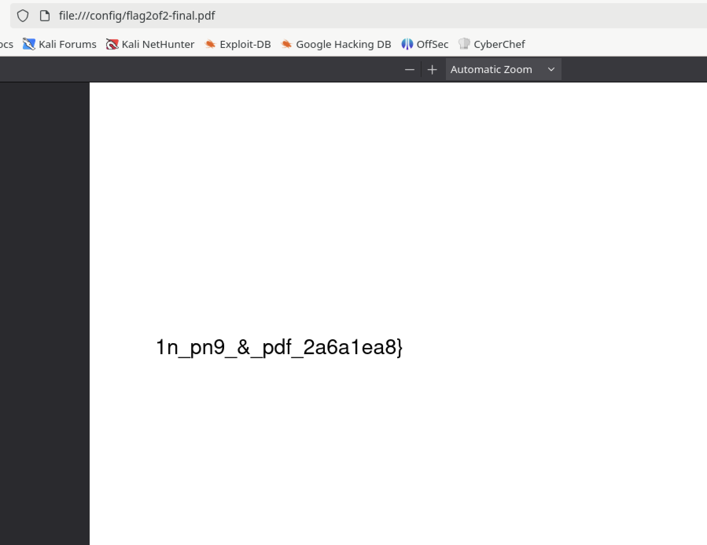
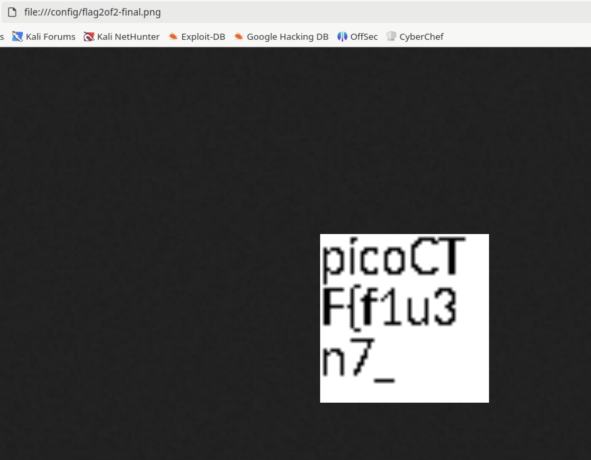

# Secret of the Polyglot

## Forensics

### The Network Operations Center (NOC) of your local institution picked up a suspicious file, they're getting conflicting information on what type of file it is. They've brought you in as an external expert to examine the file. Can you extract all the information from this strange file?

The challenge has a file to download called flag2of2-final.pdf.

First run the `file` command against it.

```sh
% file flag2of2-final.pdf
flag2of2-final.pdf: PNG image data, 50 x 50, 8-bit/color RGBA, non-interlaced
```

Interesting.  The OS sees this as a PNG file.  Let's open it in a browser.



Okay, that's half the flag.  

Let's change the extension to match the file type.  E.g., `cp flag2of2-final.pdf flag2of2-final.png`



And there's the first part of the flag

In case your asking yourself how the heck that worked, a polyglot file is a valid in multiple file formats (or programming languages).  I can only describe it at a very high level.  There are several good references if you want to dive in.  I'd start [here](https://en.wikipedia.org/wiki/Polyglot_(computing)).

**picoCTF{f1u3n7_1n_pn9_&_pdf_2a6a1ea8}**


