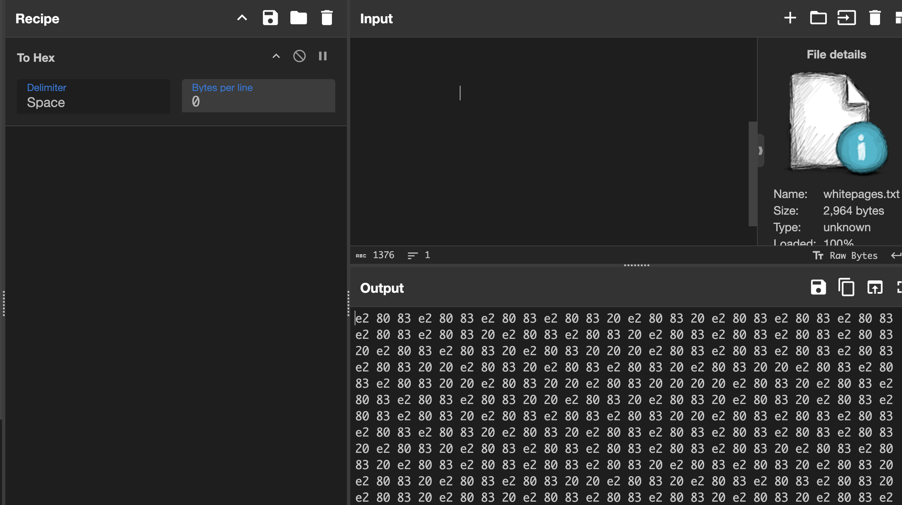
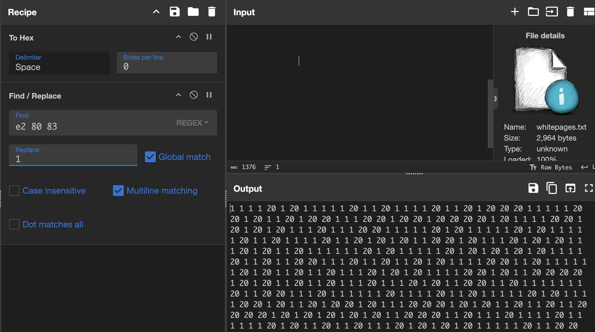
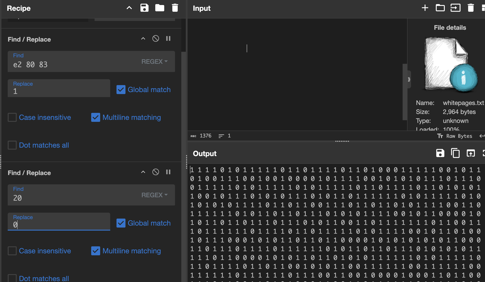
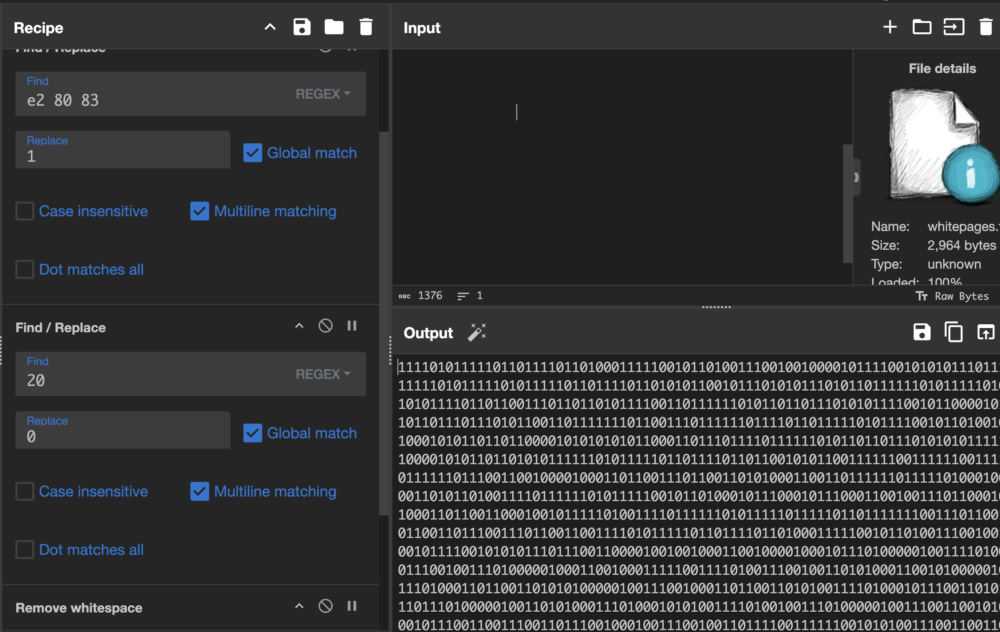
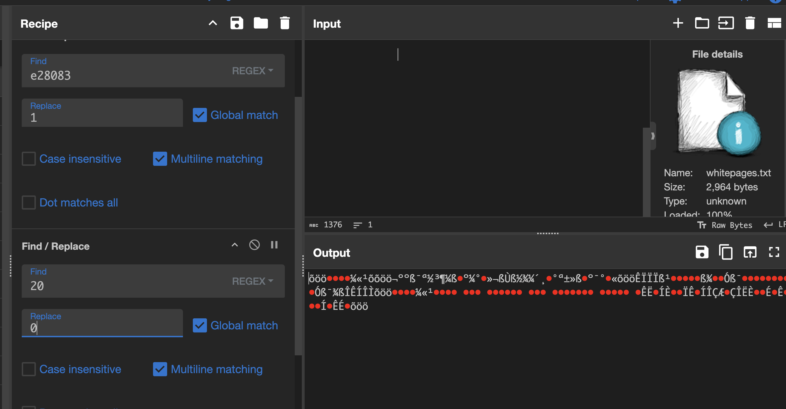
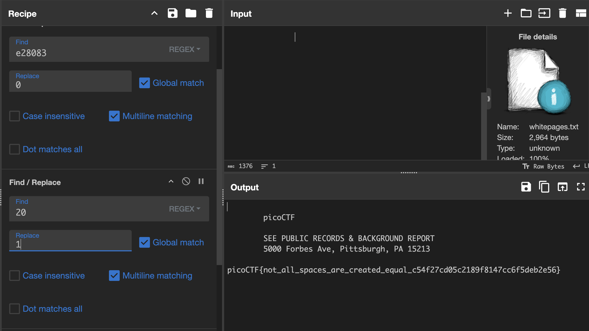
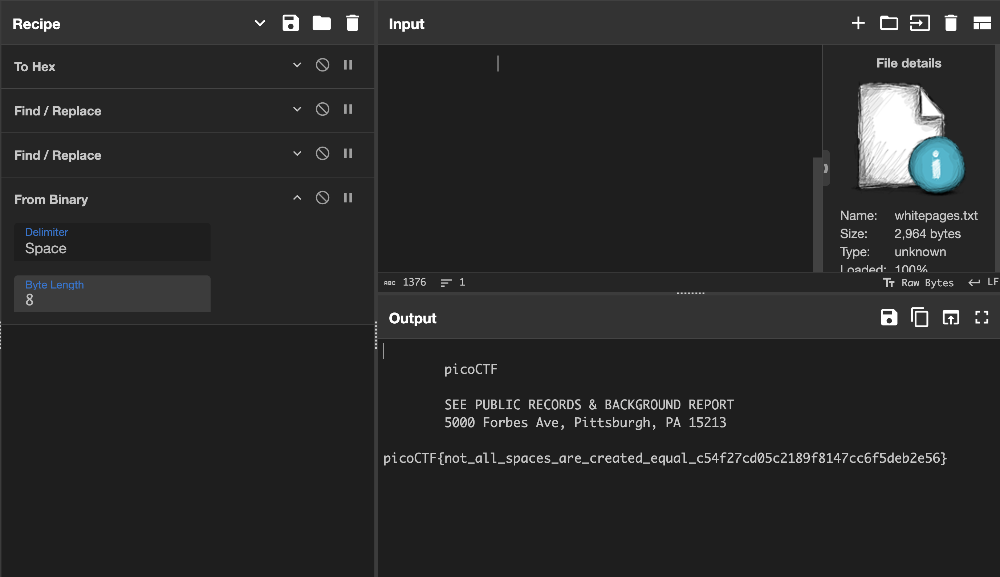

# WhitePages

## Forensics

### I stopped using YellowPages and moved onto WhitePages... but the page they gave me is all blank!

```sh
% file whitepages.txt
whitepages.txt: Unicode text, UTF-8 text, with very long lines (1376), with no line terminators

% cat whitepages.txt
                                                                                                                                                                                                                                                                                                                                                                                                                                                                                                                                                                                                                                                                                                                                                                                                                                                                                                                                                                                                                                                                                                                                                                                                                                                                                                                                                                                                                                
%
```

Interesting!  Time for a hex dump.

```sh
% hexdump whitepages.txt
0000000 80e2 e283 8380 80e2 e283 8380 e220 8380
0000010 e220 8380 80e2 e283 8380 80e2 e283 8380
0000020 e220 8380 80e2 2083 80e2 e283 8380 80e2
0000030 e283 8380 e220 8380 80e2 2083 80e2 2083
0000040 2020 80e2 e283 8380 80e2 e283 8380 80e2
0000050 2083 e220 8380 e220 8380 80e2 2083 80e2
0000060 2083 e220 8380 80e2 e283 8380 2020 80e2
0000070 2083 e220 8380 2020 2020 80e2 2083 80e2
0000080 e283 8380 80e2 e283 8380 2020 80e2 2083
0000090 80e2 2083 80e2 2083 80e2 e283 8380 80e2
00000a0 2083 80e2 e283 8380 80e2 2083 e220 8380
00000b0 80e2 e283 8380 80e2 e283 8380 e220 8380
00000c0 e220 8380 80e2 e283 8380 80e2 e283 8380
00000d0 e220 8380 e220 8380 80e2 e283 8380 80e2
00000e0 e283 8380 e220 8380 80e2 2083 80e2 e283
00000f0 8380 80e2 e283 8380 e220 8380 80e2 2083
0000100 80e2 2083 80e2 2083 80e2 e283 8380 2020
0000110 80e2 2083 80e2 e283 8380 80e2 2083 80e2
0000120 2083 80e2 2083 80e2 e283 8380 80e2 2083
0000130 80e2 2083 80e2 e283 8380 e220 8380 80e2
0000140 e283 8380 80e2 e283 8380 80e2 2083 80e2
0000150 2083 80e2 e283 8380 80e2 e283 8380 80e2
```

Okay, well it's not empty.  This has to do with utf-8. Let's look at it in CyberChef.  You couldn't see anything in the output panel in CyberChef either, so I used the To Hex recipe and now we're getting somewhere.



This pattern looks suspiciously like it's repeating.  First to investigate the e2 80 83 numbers.  Turns out it is the hex representation of the Unicode Character 'EM SPACE' (U+2003).  The comments say "nominally, a space equal to the type size in points may scale by the condensation factor of a font"

[u+2003](https://www.fileformat.info/info/unicode/char/2003/index.htm)

I also notice some 20 values in there too but nothing else pops out.  0x20 is the hex value for a space in ASCII. Time to use CyberChef to clean this up.

First, use the Find/Replace recipe to change all 'e28083's to 1's.



Yeah, it looks like there are just 20's yet.  Let's convert them to 0's



Now to remove the whitespace



And convert it From Binary



Nope!  Let's flip the 1's and 0's



W00t!

So the full recipe was:



```sh
		picoCTF

		SEE PUBLIC RECORDS & BACKGROUND REPORT
		5000 Forbes Ave, Pittsburgh, PA 15213
		picoCTF{not_all_spaces_are_created_equal_c54f27cd05c2189f8147cc6f5deb2e56}
```

**picoCTF{not_all_spaces_are_created_equal_c54f27cd05c2189f8147cc6f5deb2e56}**


