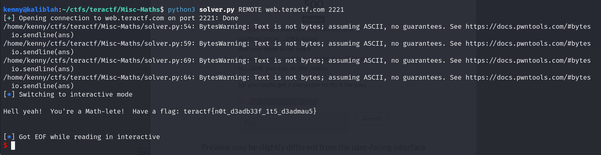

# Maths

##  Misc

### It's just simple addition, subtraction, and multiplication!....2000 times And you have to be quick If you answer a problem a second you'll be done in....Well, you can do the maths.  (or you could get a computer to do it for you)


2000 math problems?  At a second each it would take about 33 minutes to answer them all.  Definitely need to automate this one.

And that's exactly what I do.

```python
from pwn import *

# Allows you to switch between local/GDB/remote from terminal
def start(argv=[], *a, **kw):
    if args.GDB:  # Set GDBscript below
        return gdb.debug([exe] + argv, gdbscript=gdbscript, *a, **kw)
    elif args.REMOTE:  # ('server', 'port')
        return remote(sys.argv[1], sys.argv[2], *a, **kw)
    else:  # Run locally
        return process([exe] + argv, *a, **kw)

# Binary filename
exe = './maths'
# This will automatically get context arch, bits, os etc
elf = context.binary = ELF(exe, checksec=False)
# Change logging level to help with debugging (error/warning/info/debug)
#context.log_level = 'debug'

# ===========================================================
#                    EXPLOIT GOES HERE
# ===========================================================
io = start()

for i in range(2000):
   question =  io.recvuntil(b'?')
   q = question.decode('utf-8').split()
   if '+' in q:
       x, y = int(q[2]),int(q[4])
       ans = str(x + y)
       io.sendline(ans)
   elif '-' in q:
       x, y = int(q[2]),int(q[4])
       ans = str(x - y)
       io.sendline(ans)
   elif 'squared?' in q:
       x = int(q[2])
       ans = str(x**2)
       io.sendline(ans)
   elif '*' in q:
       x,y = int(q[2]), int(q[4])
       ans = str(x * y)
       io.sendline(ans)
   else:
       print(f"WTF??")
       exit()

# Receive the flag
io.interactive()
```
Running it gets the flag:




**teractf{n0t_d3adb33f_1t5_d3admau5}**


